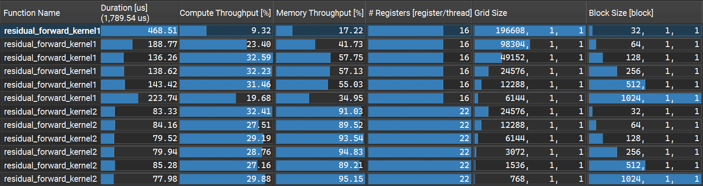
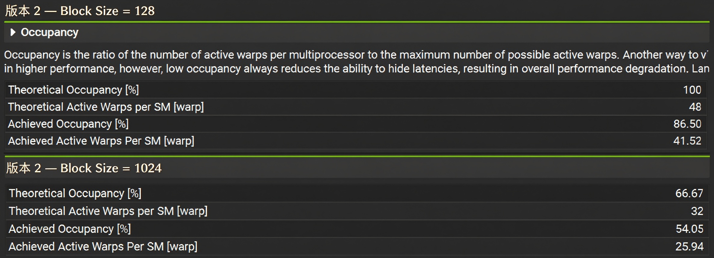

# Residual Forward — 残差连接

Transformer 中的残差连接算子，实现两个张量的逐元素相加（out = inp1 + inp2）

典型的**访存受限型算子（Memory-Bound）**（2读1写，计算量可忽略），核心优化目标是打满**显存带宽（Memory Throughput）**。

## 版本迭代

### 版本 1 — 逐元素朴素并行
每个线程处理 1 个 BF16 元素（2 字节）。访存指令数量多，发射调度开销大，显存总线请求不连续，带宽利用率不足。
```cuda
__global__ void residual_forward_kernel1(floatX* out, const floatX* inp1, const floatX* inp2, int N) {
    int idx = blockIdx.x * blockDim.x + threadIdx.x;
    if (idx < N) {
        out[idx] = (floatX)((float)inp1[idx] + (float)inp2[idx]);
    }
}
```

### 版本 2 — 128bit 向量化访存
每个线程通过 128bit 向量指令（x128）一次处理 8 个 BF16 元素（16 字节），访存指令数减少 8 倍。
```cuda
__global__ void residual_forward_kernel2(floatX* out, const floatX* inp1, const floatX* inp2, int N) {
    int idx = (blockIdx.x * blockDim.x + threadIdx.x) * x128::size;
    if (idx < N) {
        x128 packed_out;
        x128 packed_inp1 = load128cs(inp1 + idx); // 输入仅读取一次，流式加载
        x128 packed_inp2 = load128cs(inp2 + idx);
        for (int k = 0; k < packed_inp1.size; ++k) {
            packed_out[k] = (floatX)((float)packed_inp1[k] + (float)packed_inp2[k]);  // 输入BF16→计算FP32→输出BF16，避免低精度累加损失
        }
        store128(out + idx, packed_out); // 输出保留在缓存，供后续算子复用
    }
}
```

| 指标 | 版本1 朴素版 | 版本2 向量化 |
| :--- | :--- | :--- |
| Kernel耗时 | 136.26 μs | 77.98 μs |
| DRAM带宽利用率 | 57.75% | 95.15% |
| 单线程寄存器 | 16 | 22 |
| 最优Block Size | 128 | 1024 |

**整体性能提升 1.75 倍**，带宽利用率从 58% 提升至 95%，接近显存带宽理论峰值。

### 全尺寸性能对比


## 优化原理

### 1. 128bit 向量化访存

向量化的核心价值是提升指令发射端效率。

- **v1**：每线程仅处理 2 字节，全量数据需 8 倍访存指令，指令发射、warp 调度与地址译码的固定开销被放大，SM 发射槽利用率低，显存总线长期半空闲。
- **v2**：每线程处理 16 字节，访存指令总数减少 8 倍，固定开销大幅摊薄，SM 指令发射效率显著提升，最终将显存带宽拉满至接近硬件上限。

**发射槽利用率：**


### 2. 流式加载（`__ldcs`）

残差连接的输入数据（inp1 和 inp2）在计算完成后便不再被本算子复用。若使用默认加载策略，这些一次性数据会占用宝贵的 L1/L2 缓存空间。 

这里使用了 load128cs（Cache Streaming）。该指令会将加载的数据标记为 "evict-first"（优先驱逐），在数据被消费后迅速腾出缓存空间。避免对 L1 缓存造成污染，为后续操作留出了缓存余量。

### 3. 混合精度计算（BF16 → FP32 → BF16）

代码在计算过程中将 BF16 张量提升为 FP32 进行加法运算，然后再转换回 BF16 输出。 

这种策略在保持访存带宽减半（BF16 优势）的同时，避免了低精度加法可能带来的累积误差，兼顾了性能与数值稳定性。

## 补充说明
为什么 66% 的 Occupancy 能跑赢 100%？

在版本2的调优中，有个反直觉的现象：Block Size = 1024 的实测耗时（77.98 μs）优于 Block Size = 128（79.52 μs），但前者的理论 Occupancy 仅为 66.67%，后者高达 100%。



**原理分析：**

**1**.Occupancy 并非性能指标：Occupancy 是隐藏内存延迟的工具。对于纯访存受限（Memory-Bound）算子，一旦活跃 Warp 数量足以填满 LSU 和 DRAM 的请求队列（Saturation Point），额外的 Occupancy 只会增加队列拥塞，不会提升带宽。

**2**.摊薄 Block 调度开销：Block 128 会启动 6144 个 Block，而 Block 1024 仅启动 768 个。大 Block 显著减少了 GigaThread 调度开销、上下文切换和 Block 频繁退役带来的流水线气泡。

**结论**：对于访存受限型算子（Memory-Bound），Occupancy 只是隐藏延迟的手段，而不是目的。只要活跃的 Warp 数量足够打满内存总线，再增加 Occupancy 就毫无意义，甚至适得其反。


## 后续优化方向

单算子层面已接近显存带宽物理上限（受限于 DRAM 刷新、读写切换和 ECC 开销，剩余空间不足 5%），更高收益的优化方向为：

**算子融合**：当前残差连接需要独立占用 3 次访存（2读1写）。若后续算子为 LayerNorm / GEMM，可将其融合其中，直接在寄存器内完成加法，消除中间显存读写。
