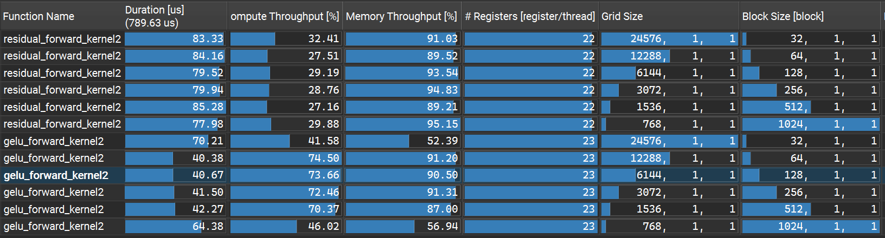
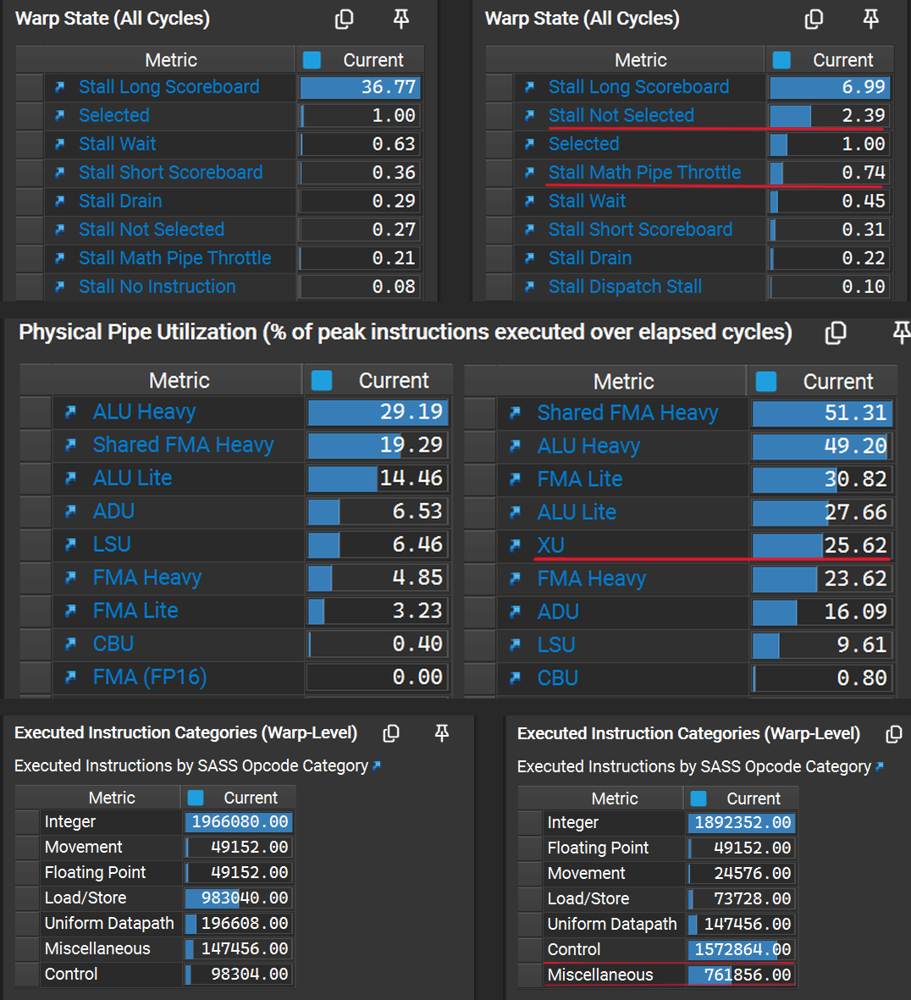

# GELU Forward — GELU 激活函数

Transformer 中标准的高斯误差线性单元激活函数，逐元素非线性变换。

典型的**访存为主、计算不可忽略的算子**（1读1写 + tanh 超越函数），
核心优化目标是在保证数值精度的前提下尽量打满显存带宽。

### tanh 近似版 GELU

相比精确的 erf 版，采用 tanh 近似公式，在精度损失可忽略的前提下能大幅提升计算速度。

$$ \text{GELU}(x) = 0.5x \cdot \left(1 + \tanh\left(\sqrt{\frac{2}{\pi}} \cdot (x + 0.044715x^3)\right)\right) $$

---

## 版本迭代

### 版本 1 — 逐元素朴素并行

每个线程处理 1 个 BF16 元素（2 字节）。访存指令数量多，发射调度开销大，
显存总线请求不连续，带宽利用率不足。

```cuda
__global__ void gelu_forward_kernel1(floatX* out, const floatX* inp, int N) {
    int i = blockIdx.x * blockDim.x + threadIdx.x;
    if (i < N) {
        float xi = inp[i];
        float cube = 0.044715f * xi * xi * xi;
        out[i] = 0.5f * xi * (1.0f + tanhf(GELU_SCALING_FACTOR * (xi + cube)));
    }
}
```

### 版本 2 — 128bit 向量化访存 + 标量计算

每个线程通过 128bit 向量指令一次加载/存储 8 个 BF16 元素（16 字节），
访存指令数减少为原来的 1/8；计算部分仍逐个标量执行。

```cuda
__global__ void gelu_forward_kernel2(floatX* out, const floatX* inp, int N) {
    int i = (blockIdx.x * blockDim.x + threadIdx.x) * x128::size;
    if (i < N) {
        x128 packed_out;
        x128 packed_inp = load128cs(inp + i); // 输入只读一次，流式加载
        for (int k = 0; k < packed_inp.size; ++k) {
            float xi = (float)packed_inp[k];
            float cube = 0.044715f * xi * xi * xi;
            packed_out[k] = (floatX)(0.5f * xi * (1.0f + tanhf(GELU_SCALING_FACTOR * (xi + cube))));
        }
        store128(out + i, packed_out); // 输出保留缓存，供下一层复用
    }
}
```

### 全尺寸性能对比


| 指标 (block=128) | 版本 1 | 版本 2 |
| :--- | :--- | :--- |
| Kernel耗时 | 133.66 µs | 40.67 µs |
| 内存吞吐量 (Memory Throughput) | ~28.5% | ~90.5% |
| 内存吞吐量 (Memory Throughput) | ~35.8% | ~73.7% |
| 单线程寄存器 | 16 | 23 |

**带宽利用率从 28.5% 提升至 90.5%**，接近访存主导型算子的合理上限。

<br>

## 优化原理

### 1. 访存向量化

比起单线程每次读写 2 字节，128bit 向量指令一次读写 16 字节，访存指令数减少 8 倍，压缩指令发射与调度开销，最大化显存总线利用率。

### 2. 计算标量化
GELU 包含 tanh 超越函数，计算部分逐个标量执行，并使用混合精度计算（BF16 → FP32 → BF16），计算过程提升到 FP32 保证精度

### 3. 缓存策略

结合算子上下游场景选择缓存指令：

- **读：`load128cs` 流式加载**：输入数据仅读取一次，用完即弃，
  不在 L1 长期驻留，避免缓存污染，为后续层留出缓存余量。
- **写：`store128` 普通存储**：GELU 输出是下一层算子的输入，很快会被再次读取，
  保留在缓存中可提升后续算子的缓存命中率。

<br>

## 后续优化方向

和残差连接一样，进行**算子融合**：将 GELU 与上游线性层 / 残差加法融合为一个 Kernel，
直接消除中间张量的全局显存读写，在寄存器内完成计算，是 Transformer 推理的标准优化。

<br>
<br>
<br>

## 补充

#### 和 residual 残差连接算子相比，同样是访存受限，同样的优化方式，为什么 gelu 的带宽只有近 91%，而 residual 能跑到 95%？



| 指标（block=128） | 残差算子 | GELU 算子 |
| :--- | :---: | :---: |
| 耗时 | 79.52 μs | 40.67 μs |
| 计算吞吐量 (Compute Throughput) | ~29% | **~74%** |
| 内存吞吐量 (Memory Throughput) | **~95%** | ~90% |
| 每元素计算量 | 1 次加法 | 三次方 + tanh + 多次乘加 |

>GELU 整体仍是访存受限型，但**计算密度显著高于纯访存算子**，导致了带宽利用率的差距。

**性能对比：左边是residual，右边是gelu，blocksize 都选自 128**



#### 性能分析：计算延迟打断了访存指令的连续发射

**1. 残差算子：纯粹的“内存等待者”**

残差算子计算极其简单（仅一次加法），其 Warp State 显示 `Stall Long Scoreboard`（等访存返回）高达 **36.77**，而 `Stall Not Selected`（等待发射）仅为 **0.27**。说明 SM 的指令发射端极空闲，LSU 可以像机关枪一样连续发射 `LDG.128` 访存指令，DRAM 总线被持续喂饱，轻松达到 95% 的物理极限。

**2. GELU 算子：计算管线引发“交通拥堵”**

GELU 包含 `tanhf` 超越函数，指令流中混杂了大量的 `Control`、`Miscellaneous`。导致：
* **计算管线拥塞**：`XU`（SFU）利用率升至 **25.62%**，`Shared FMA Heavy` 达到 **51.31%**。虽然未达 100%，但长延迟的 SFU 指令导致 Warp 在 `Math Pipe Throttle`（计算管线拥塞）和 `Short Scoreboard`（等计算完成）上停顿。
* **发射端口拥挤**：`Stall Not Selected` 从 0.27 增至 **2.39**，`Stall Math Pipe Throttle` 从 0.21 增至 **0.74**。SM 每周期只能发射有限条指令，当大量 Warp 都在排队等待发射计算指令和控制指令时，LSU 就无法连续发射访存请求。
* **总线空泡**：访存请求队列的接续被打断，DRAM 总线出现微小空泡，最终导致带宽从 95% 降至 91%。

#### 结论
GELU 达不到 residual 那样的带宽，**是因为它的计算复杂度稀释了访存指令的密度，并在流水线中产生了计算延迟，导致访存指令无法连续发射喂饱总线。**
