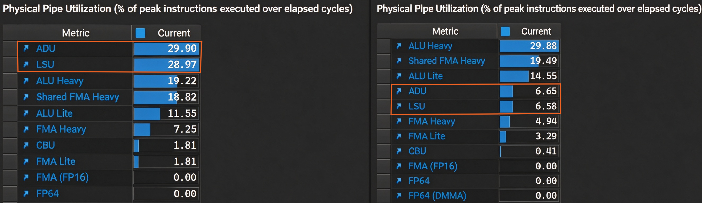
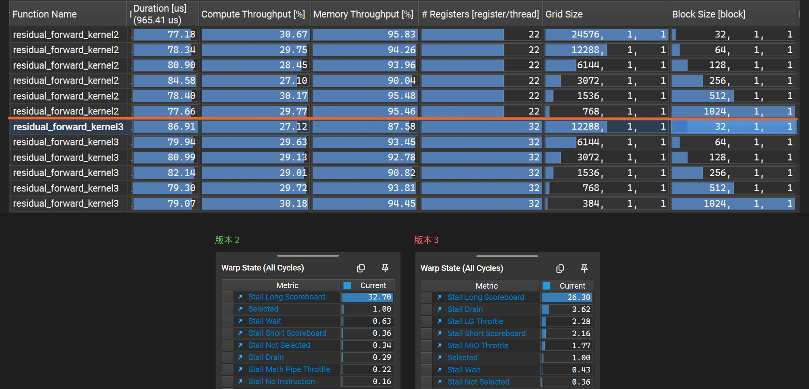

# Residual Forward — 残差连接

Transformer 中的残差连接算子，实现两个张量的逐元素相加（out = inp1 + inp2）

典型的**访存受限型算子（Memory-Bound）**（2读1写，计算量可忽略），核心优化目标是打满**显存带宽（Memory Throughput）**。

## 版本迭代

### 版本 1 — 逐元素朴素并行
每个线程处理 1 个 BF16 元素（2 字节）。访存指令数量多，发射调度开销大，显存总线请求不连续，带宽利用率不足。
```cuda
__global__ void residual_forward_kernel1(floatX* out, const floatX* inp1, const floatX* inp2, int N) {
    int idx = blockIdx.x * blockDim.x + threadIdx.x;
    if (idx < N) {
        out[idx] = (floatX)((float)inp1[idx] + (float)inp2[idx]);
    }
}
```

### 版本 2 — 128bit 向量化访存
每个线程通过 128bit 向量指令（x128）一次处理 8 个 BF16 元素（16 字节），访存指令数减少为原来的 1/8。
```cuda
__global__ void residual_forward_kernel2(floatX* out, const floatX* inp1, const floatX* inp2, int N) {
    int idx = (blockIdx.x * blockDim.x + threadIdx.x) * x128::size;
    if (idx < N) {
        x128 packed_out;
        x128 packed_inp1 = load128cs(inp1 + idx); // 输入仅读取一次，流式加载
        x128 packed_inp2 = load128cs(inp2 + idx);
        for (int k = 0; k < packed_inp1.size; ++k) {
            packed_out[k] = (floatX)((float)packed_inp1[k] + (float)packed_inp2[k]);  // 输入BF16→计算FP32→输出BF16，避免低精度累加损失
        }
        store128(out + idx, packed_out); // 输出保留在缓存，供后续算子复用
    }
}
```

| 指标 | 版本1 朴素版 | 版本2 向量化 |
| :--- | :--- | :--- |
| Kernel耗时 | 136.26 μs | 77.98 μs |
| DRAM带宽利用率 | 57.75% | 95.15% |
| 单线程寄存器 | 16 | 22 |
| 最优Block Size | 128 | 1024 |

**整体性能提升 1.75 倍**，带宽利用率从 58% 提升至 95%，接近显存带宽理论峰值。

### 全尺寸性能对比


<br>

## 优化原理

### 1. 128bit 向量化访存

向量化的核心价值是提升指令发射端效率。

- **版本1**：每线程仅处理 2 字节，同样的总数据需 8 倍访存指令，指令发射、warp 调度与地址译码的固定开销被放大，SM 发射槽利用率低，显存总线长期半空闲。
- **版本2**：每线程处理 16 字节，访存指令总数减少 8 倍，固定开销大幅摊薄，SM 指令发射效率显著提升，最终将显存带宽拉满至接近硬件上限。

**物理流水线利用率对比：左边版本1，右边版本2**

ADU（地址生成单元）、LSU（加载存储单元）利用率：29% → 6.6%，下降约 77%。说明用更少的指令完成了访存。



**发射槽利用率截图：左边版本1，右边版本2**

发射槽理论加速空间：42.25% → 4.85%，指令发射节奏接近硬件峰值。


### 2. 流式加载（`__ldcs`）

残差连接的输入数据（inp1 和 inp2）在计算完成后便不再被本算子复用。若使用默认加载策略，这些一次性数据会占用宝贵的 L1/L2 缓存空间。 

这里使用了 load128cs（Cache Streaming）。该指令会将加载的数据标记为 "evict-first"（优先驱逐），在数据被消费后迅速腾出缓存空间。避免对 L1 缓存造成污染，为后续操作留出了缓存余量。

### 3. 混合精度计算（BF16 → FP32 → BF16）

在计算过程中将 BF16 张量提升为 FP32 进行加法运算，然后再转换回 BF16 输出。 

这在保持访存带宽减半（BF16 优势）的同时，避免了低精度加法可能带来的累积误差，兼顾了性能与数值稳定性。

<br>

## 补充说明
为什么 66% 的 Occupancy 能跑赢 100%？

在版本2的调优中，有个反直觉现象：Block Size = 1024 的实测耗时（77.98 μs）略优于 Block Size = 128（79.52 μs），但前者的理论 Occupancy 仅为 66.67%，后者高达 100%。


**原理分析：**

**1.** Occupancy 并非性能指标：Occupancy 是隐藏内存延迟的工具。对于纯访存受限算子，一旦活跃 Warp 数量足以填满 LSU 和 DRAM 的请求队列，额外的 Occupancy 只会增加队列拥塞，不会提升带宽。

**2.** 摊薄调度开销：Block 128 会启动 6144 个 Block，而 Block 1024 仅启动 768 个。大 Block 降低了 GigaThread 调度开销、上下文切换和小 Block 频繁调度产生的流水线气泡。

**结论**：对于访存受限型算子，Occupancy 只是隐藏延迟的手段，而不是目的。只要活跃的 Warp 数量足够打满内存总线，再增加 Occupancy 就毫无意义，甚至适得其反。所以 CUDA 的优化原则之一：不盲目追求高 Occupancy，要先定位算子的真正瓶颈。

<br>

## 后续优化方向

单算子层面已接近显存带宽物理上限（受限于 DRAM 刷新、读写方向切换损耗和 ECC 硬件开销等，剩余空间不足 5%），更高收益的优化方向为：

**算子融合**：当前残差连接需要独立占用 3 次访存（2读1写）。后续算子为 LayerNorm / GEMM 时，可将其融合其中，直接在寄存器内完成加法，消除中间显存读写。

<br>
<br>

## 最后再展示一个负优化版本

### 版本 3 — 线程粗化版（每线程 2个x128 包）

尝试每个线程处理 2 个连续数据包，并行发起 4 路独立访存，

期望通过更高的指令级并行（ILP）进一步喂饱显存总线。

```cuda
__device__ __forceinline__ x128 residual_compute(x128 a, x128 b) {
    x128 out;
    for (int k = 0; k < a.size; ++k) {
        out[k] = (floatX)((float)a[k] + (float)b[k]);
    }
    return out;
}

__global__ void residual_forward_kernel3(floatX* out, const floatX* inp1, const floatX* inp2, int N) {
    // 每个线程处理 2 个 x128 包
    int i1 = (blockIdx.x * blockDim.x + threadIdx.x) * x128::size * 2;
    int i2 = i1 + x128::size;

    if (i2 < N) { // 双包完整
        // 并行发起 4 路独立访存，提升内存级并行 (MLP)
        x128 inp1_pack1 = load128cs(inp1 + i1);
        x128 inp1_pack2 = load128cs(inp1 + i2);
        x128 inp2_pack1 = load128cs(inp2 + i1);
        x128 inp2_pack2 = load128cs(inp2 + i2);

        x128 out1 = residual_compute(inp1_pack1, inp2_pack1);
        x128 out2 = residual_compute(inp1_pack2, inp2_pack2);

        store128(out + i1, out1);
        store128(out + i2, out2);
    } else if (i1 < N) { // 尾部单包
        x128 inp1_tail = load128cs(inp1 + i1);
        x128 inp2_tail = load128cs(inp2 + i1);
        x128 out_tail = residual_compute(inp1_tail, inp2_tail);
        store128(out + i1, out_tail);
    }
}
```

**版本2与版本3性能对比，结果：全面负优化**



从截图可见，版本3在几乎所有 block size 下性能均弱于版本2。以 block size 128 为例，两者理论 Occupancy 都是 100%：

| 指标 | 版本2 | 版本3 | 变化 |
|------|:--:|:--:|------|
| 耗时 | 80.90 us | 80.99 us | +0.11% |
| 带宽利用率 | 93.96% | 92.78% | **-1.18%** |
| 单线程寄存器 | 22 | 32 | +45% |

**原因分析：总线饱和后，指令并发只会造成拥堵**

| 停滞原因 | 版本2 | 版本3 | 变化 |
|----------|:--:|:--:|------|
| Long Scoreboard（等访存返回） | 32.70% | 26.30% | ↓ 6.40% |
| **Drain（流水线排空）** | 0.29% | **3.62%** | **↑ 3.33%** |
| **LG Throttle（LSU限流）** | 0.00% | **2.28%** | **↑ 2.28%** |
| Short Scoreboard（等计算完成） | 0.36% | 2.16% | ↑ 1.80% |
| MIO Throttle（内存IO限流） | — | 1.77% | 新增 |

版本3的 Long Scoreboard 降至26.30%，但 **Drain 从0.29%飙升至3.62%，LG Throttle 从0涨到2.28%**

这说明：DRAM总线已经饱和，再多的访存指令也塞不进去，反而在发射端堆积成拥堵——LSU队列满了之后开始限流，流水线频繁排空。
**瓶颈不在"访存不够并行"，而在"总线已经满了，再加请求只会排队"。**

**次生因素**：单线程寄存器从22 → 32个，SM可调度Warp数量减少，进一步削弱延迟隐藏能力。主要体现在block size = 32。

**结论**：线程粗化对纯访存受限、带宽已触顶的算子**无收益甚至负向**。其更适合被使用在计算受限的算子上。
