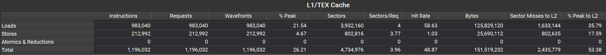
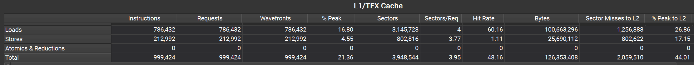
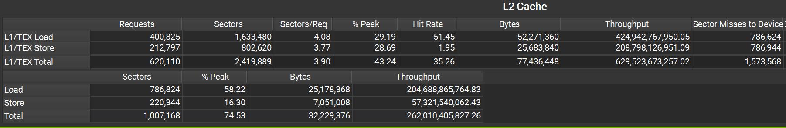
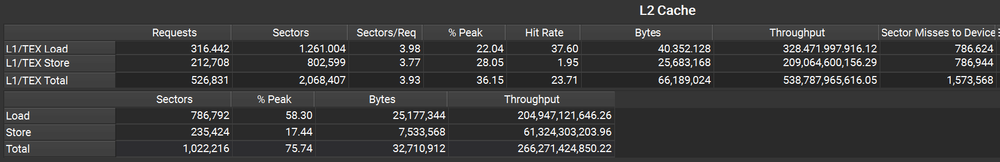

# LayerNorm Forward — CUDA 算子优化实战

从 CPU 朴素移植到工业级向量化实现，完整记录 LayerNorm 前向传播算子在 GPU 上的 6 个版本迭代过程。

---

## 算子简介

LayerNorm 对每个 Token 的特征通道做归一化：

```
y = (x - E[x]) / sqrt(Var(x) + eps) * weight + bias
```

这是一个**访存受限型算子（Memory-Bound）**：

- **计算量**：均值规约 + 方差规约 + 逐元素归一化 + 缩放平移
- **访存量**：读 input + 读 weight/bias + 写 output
- **优化核心**：在规约计算和访存效率之间找平衡，尽可能打满显存带宽

---

## 性能总览


| 版本 | 核心实现 | 耗时 (ms) | Compute (%) | Memory (%) | 寄存器 |
|:---:|---|:---:|:---:|:---:|:---:|
| v1 | CPU 朴素移植，1 线程处理 1 行 | 1.00 | 5.83 | 63.58 | 40 |
| v2 | 三 Kernel 拆分，Block 级共享内存规约 | 0.34 | — | — | — |
| v3 | Warp 级两趟法，shuffle 规约 | 0.12 | 57.09 | 74.53 | 26 |
| v4 | Warp 级单趟法，E[x²]−E[x]² | 0.12 | 47.26 | 75.74 | 24 |
| v5 | Block 级两级规约，适配大 C | 0.15 | 62.98 | 69.05 | 22 |
| v6 | 共享内存 + 128bit 向量化 | **0.11** | 26.08 | **83.39** | 42 |

> v2 耗时为三个 Kernel 之和：mean 0.08 + rstd 0.09 + norm 0.17 = 0.34 ms。

**从 v1 到 v6，性能提升约 9 倍。** 下方逐版本拆解优化历程。

---

## v1 — 朴素移植：CPU 逻辑直接搬上 GPU

最直观的写法：在 B、T 维度并行，一个 GPU 线程负责一个 token，通道维度 C 仍然串行遍历。

```cuda
__global__ void layernorm_forward_kernel1(float* out, float* mean, float* rstd,
    const float* inp, const float* weight, const float* bias, int N, int C) {

    int idx = blockIdx.x * blockDim.x + threadIdx.x;
    if (idx >= N) return;

    const float* x = inp + idx * C;

    // 三趟串行循环：均值 → 方差 → 归一化
    float m = 0.0f;
    for (int i = 0; i < C; i++) m += x[i];
    m /= C;

    float v = 0.0f;
    for (int i = 0; i < C; i++) {
        float d = x[i] - m;
        v += d * d;
    }
    v /= C;
    float s = rsqrtf(v + 1e-5f);

    float* o = out + idx * C;
    for (int i = 0; i < C; i++) {
        o[i] = s * (x[i] - m) * weight[i] + bias[i];
    }
    mean[idx] = m;
    rstd[idx] = s;
}
```

### 问题

- **一个线程串行跑 C=768 次循环**，GPU 上有几千个 CUDA Core，但每个线程是串行的，算力严重浪费。
- **读 input 三次**（均值、方差、归一化各一趟），访存效率低。
- Compute Throughput 只有 5.83%——几乎没用到算力，纯粹被串行循环卡住了。

---

## v2 — 三 Kernel 拆分

v1 的问题是通道维度 C 完全串行。v2 把 C 维度也并行化，将 LayerNorm 的均值计算、方差计算、归一化操作分别拆分为三个独立的 Kernel：

1. **`mean_kernel`**：1 个 Block 处理 1 行，Block 内多线程分摊 C 个元素，用**共享内存二分规约**求均值。
2. **`rstd_kernel`**：同理求方差倒数。
3. **`normalization_kernel`**：展开成并行——每个线程处理 1 个输出元素。

```cuda
// 分块一：算均值（Block 级共享内存二分规约）
__global__ void mean_kernel(float* mean, const float* inp, int N, int C, int block_size) {
    extern __shared__ float shared[];
    int idx = blockIdx.x;
    int tid = threadIdx.x;
    const float* x = inp + idx * C;

    // 线程粗化：block 内 block_size 个线程分摊 C 个元素
    float sum = 0.0f;
    for (int i = tid; i < C; i += block_size) sum += x[i];
    shared[tid] = sum;
    __syncthreads();

    // 二分规约：步长折半，每轮同步
    for (int stride = block_size / 2; stride >= 1; stride /= 2) {
        __syncthreads();
        if (tid < stride) shared[tid] += shared[tid + stride];
    }
    if (tid == 0) mean[idx] = shared[0] / C;
}

// 分块二：算倒标准差（结构和 mean_kernel 完全一致，只是累加内容不同）
__global__ void rstd_kernel(float* rstd, const float* inp, const float* mean, int N, int C, int block_size) {
    // ... 与 mean_kernel 完全相同的规约结构 ...
    // 中间结果 mean[idx] 从全局内存读回
    // 区别仅在于：sum += (x[i] - m)^2，最终 rstd[idx] = 1/sqrt(sum/C + eps)
}

// 分块三：归一化（每个线程处理 1 个输出元素，全并行）
__global__ void normalization_kernel(float* out, const float* inp, float* mean, float* rstd,
                                     const float* weight, const float* bias, int B, int T, int C) {
    int idx = blockIdx.x * blockDim.x + threadIdx.x;
    int bt = idx / C;      // 属于哪个 token
    int c  = idx % C;      // 通道下标

    float m = mean[bt];    // 查分块一的结果
    float s = rstd[bt];    // 查分块二的结果
    out[idx] = s * (inp[idx] - m) * weight[c] + bias[c];
}

// 三个 Kernel 在主函数中串行调用：
mean_kernel<<<N, block_size, block_size * sizeof(float)>>>(mean, inp, N, C, block_size);
rstd_kernel<<<N, block_size, block_size * sizeof(float)>>>(rstd, inp, mean, N, C, block_size);
normalization_kernel<<<grid_norm, 256>>>(out, inp, mean, rstd, weight, bias, B, T, C);
```

### 提升与问题

**提升**：C 维度并行起来了，耗时从 1.00ms 降到 0.34ms。

**问题**：
1. **三个 Kernel 串行启动**，有多次启动开销。
2. **中间结果 mean/rstd 写回全局内存**，下一个 Kernel 再读回来——多了两次不必要的全局访存。
3. Block 级规约需要**共享内存 + `__syncthreads()`**，跨 Warp 通信开销大。

> 观察 mean_kernel 和 rstd_kernel 的 Memory Throughput 都达到了 ~84%，说明纯访存操作本身已经很高效。瓶颈不在带宽，而在**Kernel 拆分带来的额外全局读写和同步**。

---

## v3 — Warp 级两趟法：去掉共享内存和中间写回

v2 的核心痛点是"跨 Warp 通信必须走共享内存"。那如果**一个 Warp（32 线程）独立处理一整行**呢？

- **任务划分**：1 个 Warp = 1 个 Token，32 个线程分摊 C=768 个元素。
- **规约方式**：Warp 内 32 线程通信走**硬件 shuffle 指令**（`__shfl_down_sync`），直接互读寄存器，不需要共享内存，不需要 `__syncthreads()`。
- **单 Kernel 完成全部计算**：均值、方差、归一化在同一个 Kernel 里完成，中间结果留在寄存器，不写回全局内存。
- **流式访存**：输入读一次就不再用，用 `__ldcs` 绕过缓存，给 weight/bias 留出缓存空间。

```cuda
__global__ void layernorm_forward_kernel3(
    float* __restrict__ out, float* __restrict__ mean, float* __restrict__ rstd,
    const float* __restrict__ inp, const float* __restrict__ weight,
    const float* __restrict__ bias, int N, int C) {

    namespace cg = cooperative_groups;
    cg::thread_block block = cg::this_thread_block();
    cg::thread_block_tile<32> warp = cg::tiled_partition<32>(block);

    int idx = blockIdx.x * warp.meta_group_size() + warp.meta_group_rank();
    if (idx >= N) return;
    const float* x = inp + idx * C;

    // ── 第一趟：算均值 ──
    float sum = 0.0f;
    for (int i = warp.thread_rank(); i < C; i += warp.size()) sum += x[i];
    sum = cg::reduce(warp, sum, cg::plus<float>{});  // shuffle 规约，无共享内存
    float m = sum / C;

    // ── 第二趟：算方差（两趟法，数值稳定）──
    sum = 0.0f;
    for (int i = warp.thread_rank(); i < C; i += warp.size()) {
        float d = x[i] - m;
        sum += d * d;
    }
    sum = cg::reduce(warp, sum, cg::plus<float>{});
    float s = rsqrtf(sum / C + 1e-5f);  // 硬件原生指令

    // ── 第三趟：归一化 + 仿射变换 ──
    float* o = out + idx * C;
    for (int c = warp.thread_rank(); c < C; c += warp.size()) {
        float n = s * (__ldcs(x + c) - m);
        __stcs(o + c, n * weight[c] + bias[c]);
    }
}
```

### 为什么快？

| 对比项 | v2 (Block 级) | v3 (Warp 级) |
|---|---|---|
| 规约通信 | 共享内存读写 + `__syncthreads()` | shuffle 指令，寄存器直读 |
| 中间结果 | mean/rstd 写回 DRAM 再读回 | 留在寄存器，零全局访存 |
| Kernel 数量 | 3 个 | 1 个 |
| 耗时 | 0.34 ms | **0.12 ms** |

Warp 级规约的延迟只有几个时钟周期（shuffle 是硬件指令），而 Block 级共享内存规约需要多次 `__syncthreads()`，延迟高一个数量级。

---

## v4 — 单趟法：理论上更快，然而...

v3 读了 input 两次（第一趟算均值，第二趟算方差）。数学上有个公式：

```
Var(x) = E[x²] - E[x]²
```

这样一次遍历就能同时累加 `sum(x)` 和 `sum(x²)`，省掉第二趟读 input。

```cuda
// v4 核心：一次循环同时累加 sum 和 sum2
float sum = 0.0f, sum2 = 0.0f;
for (int i = warp.thread_rank(); i < C; i += warp.size()) {
    float xi = x[i];
    sum += xi;
    sum2 += xi * xi;
}
sum  = cg::reduce(warp, sum, cg::plus<float>{});
sum2 = cg::reduce(warp, sum2, cg::plus<float>{});
float m = sum / C;
float var = sum2 / C - m * m;  // 套公式
float s = rsqrtf(var + 1e-5f);
```

### 实测：和 v3 一样快（0.12ms），为什么？

理论上少读一次 input 应该更快，但数据打平了。这里列出二个原因（**详细评测过程放在末尾**）：

1. **L2 缓存吃掉了收益**：v3 第二趟读 input 时，数据还在 L2 里（整个 input 约 25MB，RTX 5060 的 L2 缓存足够大），根本没去读 DRAM。v4 省下的那次 L2 读取，收益微乎其微。
2. **计算依赖链变长**：同时累加 sum 和 sum2，指令并行度下降，Compute Throughput 从 57.09% 降到 47.26%。

**单趟法公式的代价：数值稳定性差**

当输入数值大但方差小时（比如所有值都是 10000.1），`E[x²]` 和 `E[x]²` 都是上亿的大数，两个大数相减会丢精度，甚至算出负方差导致 NaN。

> **选型判断**：训练用 v3（两趟法数值稳定）；推理可以用 v4（推理对精度损失不敏感，效率优先）。

---

## v5 — Block 级两级规约：解决大通道数问题

v3 的局限：1 个 Warp 处理 1 行，只有 32 个线程，当 C 很大时，每个线程要循环很多次，并行度不够。

v5 回到 Block 级：1 个 Block 处理 1 行，用更多线程分摊。同时使用**两级规约**，也不像 v2 那样纯走共享内存。

```
两级规约流程：
每个线程先算局部 sum
    → Warp 内 shuffle 规约（32 线程一组，走寄存器）
    → 各 Warp 的结果写入共享内存（只写 num_warps 个 float）
    → 每个 Warp 从共享内存读回所有 Warp 的结果
    → 再做一次 Warp 内 shuffle 规约
    → 得到整个 Block 的总和
```

```cuda
// 第一级：Warp 内 shuffle 规约
float warp_sum = cg::reduce(warp, thread_sum, cg::plus<float>{});

// 跨 Warp：只写一次共享内存
shared_sum[warp_id] = warp_sum;
__syncthreads();

// 第二级：从共享内存读回，再做一次 Warp 规约
warp_sum = (lane_id < num_warps) ? shared_sum[lane_id] : 0.0f;
float block_sum = cg::reduce(warp, warp_sum, cg::plus<float>{});
```

### 为什么 C=768 时 v5 反而比 v3 慢？（0.15 vs 0.12）

v5 在 C=768 时不是最优，原因：

1. **C=768 不大**：32 个线程每个循环 24 次，已经足够并行，Block 级的优势体现不出来。
2. **多了 `__syncthreads()` 同步开销**：Warp 之间要等齐。

### 附上 C=4096 时的测试结果，此时 v5 超越了 v3（0.88 vs 1.01）


> **结论**：C 很小时 Warp 级并行更优；C 很大时 Block 级并行更优，C 越大优势越明显。

---

## v6 — 工业级：共享内存 + 128bit 向量化

v3 已经很快了，但还有两个浪费：
1. input 读了两次（均值一趟、方差一趟），就算 L2 命中也仍是开销。
2. weight/bias 每个 Warp 都要从全局内存读一次。

v6 的解法：

- **128bit 向量化访存**：一次加载 4 个 float（`float4` / `x128`），访存指令数减少到 1/4。
- **全部装进共享内存**：把 weight、bias、input 全部缓存到共享内存，后续两趟遍历都走共享内存，不再碰全局内存。
- **2D Block 设计**：`<<<grid, (32, block_y)>>>`，一个 Block 里多个 Warp 共享 weight/bias——全 Block 合力加载一次，后续共用。

```cuda
__global__ void layernorm_forward_kernel6(...) {
    extern __shared__ char params[];
    int packs = C / x128::size; // 每行数据需要的 x128 包的数量
    x128* s_weight = reinterpret_cast<x128*>(params);
    x128* s_bias   = s_weight + packs;
    x128* s_inp    = s_weight + (2 + threadIdx.y) * packs;

    // 全 Block 合力加载 weight/bias（只读一次 DRAM）
    int tidx = threadIdx.y * WARP_SIZE + threadIdx.x;
    for (int p = tidx; p < packs; p += blockDim.y * WARP_SIZE) {
        s_weight[p] = load128(weight + p * x128::size);
        s_bias[p]   = load128(bias   + p * x128::size);
    }
    __syncthreads();

    // 第一趟：向量化加载 input，算均值 + 顺手缓存到共享内存
    for (int p = threadIdx.x; p < packs; p += WARP_SIZE) {
        x128 in_data = load128cs(inp + p * x128::size);
        for (int k = 0; k < 4; k++) sum += (float)in_data[k];
        s_inp[p] = in_data;  // 第二趟算方差直接从共享内存读
    }
    float m = warpReduceSum(sum) / C;

    // 第二趟：从共享内存读 input 算方差（不碰 DRAM）
    for (int p = threadIdx.x; p < packs; p += WARP_SIZE) {
        x128 in_data = s_inp[p];
        for (int k = 0; k < 4; k++) { float d = (float)in_data[k] - m; v += d * d; }
    }
    float s = rsqrtf(v / C + eps);

    // 第三趟：全从共享内存读，向量化写回 DRAM
    for (int p = threadIdx.x; p < packs; p += WARP_SIZE) {
        x128 in_data = s_inp[p], w = s_weight[p], b = s_bias[p];
        x128 out_data;
        for (int k = 0; k < 4; k++)
            out_data[k] = (s * ((float)in_data[k] - m)) * (float)w[k] + (float)b[k];
        store128cs(out + p * 4, out_data);
    }
}
```

### 共享内存用量

C=768, block_y=4（一个 Block 4 个 Warp）：

| 区域 | 包数 (1包=16字节) | 大小 |
|---|---|---|
| weight | 768/4 = 192 | 3 KB |
| bias | 192 | 3 KB |
| input 缓存 | 4 × 192 = 768 | 12 KB |
| **合计** | 1152 | **18 KB** |

> 当前配置下 18KB < 48KB 默认上限，不需要 `cudaFuncSetAttribute`。当 C 更大时（如 C=4096），共享内存可能超过 48KB，代码会通过 `cudaFuncSetAttribute` 手动申请，失败时自动回退到 v5。

### 效果

- Memory Throughput 从 v3 的 74.53% 提升到 **83.39%**——接近 GPU 显存带宽物理上限。
- Compute Throughput 降到 26.08%——这是好事，说明已经完全被带宽卡住了，计算不再是瓶颈。
- 寄存器 42 个，比 v3 的 26 个多，但访存收益远大于寄存器占用带来的 Occupancy 损失。
>关于 Occupancy 对访存受限型算子的影响程度，详情可见我在 residual 的 README 中的描述

---

### 优化路径总结

```
v1 (1.00ms)  朴素移植，串行循环，算力浪费
  ↓ 把 C 维度并行化
v2 (0.34ms)  三 Kernel 拆分，Block 级共享内存规约
  ↓ 去掉跨 Warp 通信和中间写回
v3 (0.12ms)  Warp 级 shuffle 规约，单 Kernel 完成
  ↓ 尝试减少访存
v4 (0.12ms)  单趟法 E[x²]−E[x]²，L2 缓存吃掉了收益
  ↓ 适配大通道数
v5 (0.15ms)  Block 级两级规约，C=768 时反而慢
  ↓ 向量化 + 共享内存缓存
v6 (0.11ms)  128bit 访存 + 共享内存复用，打满带宽
```

### 规律总结

1. **规约计算的层级越低越快**：Warp shuffle（寄存器）> Block 共享内存 > 全局内存。
2. **能在单 Kernel 里做完就别拆**：中间结果写回再读回的代价，往往大于并行化的收益。
3. **访存受限算子的终极优化是减少 DRAM 访问次数**：v6 把 input 从读 2 次 DRAM 变成读 1 次，weight/bias 从每个 Warp 读一次变成全 Block 读一次。
4. **实测数据比理论分析重要**：v4 理论上少一趟访存应该更快，但实测没有超过v3——benchmark 才是真理。

---

<br>
<br>

## 为什么 v4 相比 v3 没有提速？NCU 实测数据

理论上 v4 少读一次 input 应该更快，但实测 v3 和 v4 耗时都是 0.12ms。
用 NCU 逐层拆解访存链路，原因展示：

#### 第一层：L1 Cache

**v3（两趟法）**——L1 发出 120 MB load 请求：



**v4（单趟法）**——L1 只发出 96 MB load 请求：



v3 确实多读了一趟（983,040 vs 786,432 条 load 指令，差 24 MB）。
问题是：这 24 MB 走到 DRAM 了吗？

#### 第二层：L2 Cache → DRAM

**v3（两趟法）**：



**v4（单趟法）**：



关键数据对比：

| 层级 | 指标 | v3（两趟法） | v4（单趟法） | 差异说明 |
|---|---|---|---|---|
| **L1** | Global Load Sectors | 3,932,160 | 3,145,728 | v3 多读 786,432 sectors（多一趟 input） |
| **L1** | → Miss 到 L2 Sectors | 1,633,144 | 1,256,888 | v3 多发 376,256 到 L2 |
| **L2** | 收到的 Load Sectors | 1,633,480 | 1,261,004 | v3 多收 372,476，量级一致 |
| **L2** | Hit Rate | 51.45% | 37.60% | v3 命中率高 13.85% |
| **L2** | → Miss 到 DRAM Sectors | 786,624 | 786,624 | **完全一样！** |
| **DRAM** | 实际 Load Bytes | 24 MB | 24 MB | **完全一样！** |

1. v3 在 L1 多读了 786,432 sectors（第二趟算方差）
2. 其中约一半命中 L1，另一半约 37.6 万 sectors 发到了 L2
3. v3 在 L2 的命中率（51.45%）比 v4（37.60%）高 13.85%，把多发的这部分在 L2 接住了
4. 最终两者漏到 DRAM 的都是 786,624 sectors = 24 MB，一字节都没多

#### 结论

这个算子是访存受限的，瓶颈在 DRAM 带宽（两者都跑到了 ~75%）。
v4 省掉的那趟遍历省的是 L2 读取，不是 DRAM 读取，对最终性能影响微乎其微。
同时 v4 因为同时累加 sum 和 sum2，计算依赖链变长，LSU 省下的时间被计算补回，总耗时相当。
