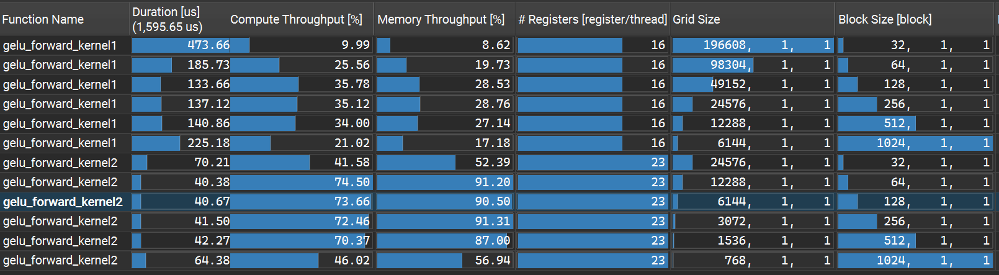

# GELU Forward — GELU 激活函数

Transformer 中标准的高斯误差线性单元激活函数，逐元素非线性变换。

典型的**访存为主、计算不可忽略的算子**（1读1写 + tanh 超越函数），
核心优化目标是在保证数值精度的前提下尽量打满显存带宽。

---

## 版本迭代

### 版本 1 — 逐元素朴素并行

每个线程处理 1 个 BF16 元素（2 字节）。访存指令数量多，发射调度开销大，
显存总线请求不连续，带宽利用率不足。

```cuda
__global__ void gelu_forward_kernel1(floatX* out, const floatX* inp, int N) {
    int i = blockIdx.x * blockDim.x + threadIdx.x;
    if (i < N) {
        float xi = inp[i];
        float cube = 0.044715f * xi * xi * xi;
        out[i] = 0.5f * xi * (1.0f + tanhf(GELU_SCALING_FACTOR * (xi + cube)));
    }
}
```

### 版本 2 — 128bit 向量化访存 + 标量计算

每个线程通过 128bit 向量指令一次加载/存储 8 个 BF16 元素（16 字节），
访存指令数减少为原来的 1/8；计算部分仍逐个标量执行。

```cuda
__global__ void gelu_forward_kernel2(floatX* out, const floatX* inp, int N) {
    int i = (blockIdx.x * blockDim.x + threadIdx.x) * x128::size;
    if (i < N) {
        x128 packed_out;
        x128 packed_inp = load128cs(inp + i); // 输入只读一次，流式加载
        for (int k = 0; k < packed_inp.size; ++k) {
            float xi = (float)packed_inp[k];
            float cube = 0.044715f * xi * xi * xi;
            packed_out[k] = (floatX)(0.5f * xi * (1.0f + tanhf(GELU_SCALING_FACTOR * (xi + cube))));
        }
        store128(out + i, packed_out); // 输出保留缓存，供下一层复用
    }
}
```

| 指标 | 版本1 朴素版 | 版本2 向量化版 |
| :--- | :--- | :--- |
| Kernel耗时 | 基准值 | 提升约 1.6~1.7 倍 |
| DRAM带宽利用率 | ~57% | ~90% |
| 计算吞吐量 | ~30% | ~73% |
| 最优Block Size | 128 | 128 |

**带宽利用率从 57% 提升至 90%**，接近访存主导型算子的合理上限。
计算侧因包含 tanh 超越函数，仍存在优化空间。

### 全尺寸性能对比



<br>

## 优化原理

### 1. 访存向量化，计算标量化

这是 GELU 与纯访存算子的区别：

- **访存部分向量化**：128bit 向量指令一次读写 16 字节，访存指令数减少 8 倍，
  摊薄指令发射与调度开销，最大化显存总线利用率。
- **计算部分标量化**：GELU 包含 `tanh` 超越函数，硬件没有对应的 128bit 向量计算指令，
  强行用向量计算反而会因指令拆分、调度低效而降速。计算部分仍逐个标量执行。

> 逐元素算子的通用优化原则：能向量化的部分尽量向量化，无对应硬件指令的部分不强行硬做。

### 2. 缓存策略

结合算子上下游场景选择缓存指令：

- **读：`load128cs` 流式加载**：输入数据仅读取一次，用完即弃，
  不在 L1 长期驻留，避免缓存污染，为后续层留出缓存余量。
- **写：`store128` 普通存储**：GELU 输出是下一层算子的输入，很快会被再次读取，
  保留在缓存中可提升后续算子的缓存命中率。

### 3. 混合精度计算（BF16 → FP32 → BF16）

访存使用 BF16 减半带宽占用，计算提升为 FP32 保证数值精度，兼顾性能与数值稳定性。

### 4. tanh 近似版 GELU

采用 tanh 近似公式，相比精确的 erf 版，在精度损失可忽略的前提下大幅提升计算速度。

$$ \text{GELU}(x) = 0.5x \cdot \left(1 + \tanh\left(\sqrt{\frac{2}{\pi}} \cdot (x + 0.044715x^3)\right)\right) $$

<br>

## 补充说明

为什么带宽只有 90%，而残差算子能跑到 95%？

GELU 整体仍是访存受限型，但**计算密度显著高于纯访存算子**，
这直接导致了带宽利用率的差距：

| 指标 | 残差算子 | GELU 算子 |
|------|:--------:|:---------:|
| 计算吞吐量 | ~30% | ~73% |
| 显存带宽利用率 | ~95% | ~90% |
| 每元素计算量 | 1 次加法 | 三次方 + tanh + 多次乘加 |

**原理：**
显存带宽跑满的前提是 SM 持续有足够多的就绪 Warp 向 LSU 提交访存请求。
GELU 包含 tanh 超越函数（走 SFU 特殊功能单元），计算延迟远高于普通加法。
Warp 大量时间停在计算态，访存请求是间断性的，总线出现空闲窗口，
平均利用率自然比纯访存的残差算子低。

---

为什么最优 Block Size 是 128，而不是 1024？

残差算子的最优 Block Size 是 1024（大 Block 摊薄调度开销），
但 GELU 的最优 Block Size 是 128。原因：

- **残差是纯访存算子**：计算量可忽略，只要活跃 Warp 数量够打满显存总线就行，
  66% Occupancy 足够，大 Block 更优。
- **GELU 有不可忽略的计算量**：tanh 计算延迟长，需要更高的 Occupancy
  来提供更多并行 Warp，用数量弥补单个 Warp 计算慢的问题，隐藏计算流水线延迟。

Block=128 时理论 Occupancy 接近 100%，足够同时隐藏访存延迟和计算延迟；
Block=1024 时 Occupancy 仅 66%，计算流水线喂不饱，性能反而下降。

> **经验规律**：算子计算密度越高，最优 Block Size 越小，对 Occupancy 的需求越高。

<br>

## 后续优化方向

和残差连接一样，进行**算子融合**：将 GELU 与上游线性层 / 残差加法融合为一个 Kernel，
直接消除中间张量的全局显存读写，在寄存器内完成计算，是 Transformer 推理的标准优化。