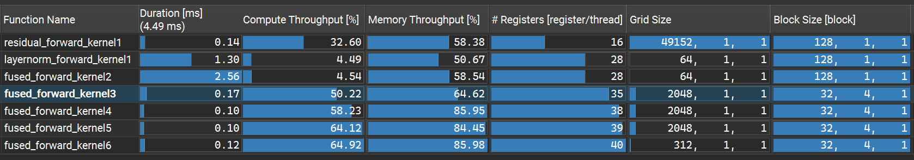
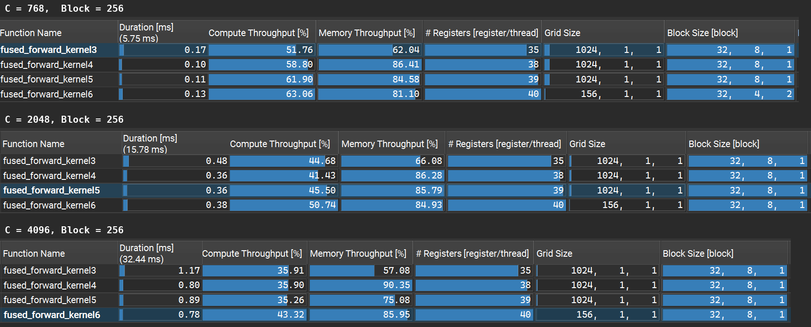
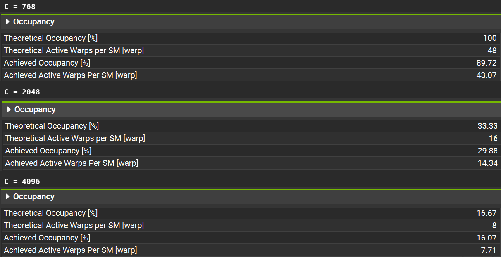

# Fused Residual + LayerNorm Forward — CUDA 算子融合优化

从两个独立 Kernel 的朴素移植，到自适应融合算子，记录 Residual + LayerNorm 在 GPU 上的 6 个版本迭代过程。

>**关于 Residual 算子和 LayerNorm 算子各自的优化历程，可阅读其 README**

---

## 算子简介

Transformer 编码器中，残差连接和 LayerNorm 是两个连续操作：

```
residual = inp1 + inp2                           # 残差连接
mean     = mean(residual)                        # 均值
rstd     = 1 / sqrt(var(residual) + eps)         # 倒标准差
normed   = (residual - mean) * rstd * weight + bias  # 归一化 + 缩放平移
```

**融合的价值**：如果不融合，中间结果 `residual`（B×T×C 大小）需要写回显存再被 LayerNorm 读回来，额外增加 2 次全局内存往返。

融合后，`residual` 留在寄存器/共享内存中直接传递，大幅减少显存流量。

这是一个**访存受限型算子（Memory-Bound）**，优化核心是减少 DRAM 访问次数和提升访存合并率。

---

## 性能总览



| 版本 | 核心实现 | 耗时 (ms) | Compute (%) | Memory (%) | 寄存器 |
|:---:|---|:---:|:---:|:---:|:---:|
| v1 | 两个独立 Kernel（非融合） | 1.44 | — | — | — |
| v2 | 朴素融合，1 线程处理 1 Token | 2.56 | 4.54 | 58.54 | 28 |
| v3 | Warp 级融合，恢复合并访存 | 0.17 | 50.22 | 64.62 | 35 |
| v4 | 128bit 向量化 + 单遍统计 + 流式访存 + 锯齿循环 | 0.10 | 58.23 | **85.95** | 38 |
| v5 | 全共享内存缓存（权重/偏置/残差） | 0.10 | 64.12 | 84.45 | 39 |
| v6 | 三维 Block + Grid-Stride 生产级自适应 | 0.12 | 64.92 | 85.98 | 40 |

> v1 耗时为两个 Kernel 之和：residual 0.14 + layernorm 1.30 = 1.44 ms。
> **从 v1 到 v5，性能提升约 14 倍。**

---

## v1 — 未融合朴素版：两个独立 Kernel

最直观的写法：residual 和 LayerNorm 各自作为独立 Kernel 顺序执行。

```cuda
// Kernel 1：残差相加，每个线程处理 1 个元素
__global__ void residual_forward_kernel1(floatX* out, const floatX* inp1, const floatX* inp2, int N) {
    int idx = blockIdx.x * blockDim.x + threadIdx.x;
    if (idx < N) out[idx] = inp1[idx] + inp2[idx];
}

// Kernel 2：LayerNorm，1 个线程处理 1 个 Token
__global__ void layernorm_forward_kernel1(...) {
    int idx = blockIdx.x * blockDim.x + threadIdx.x;
    if (idx < N) {
        const floatX* x = inp + idx * C;
        // 三趟串行循环：均值 → 方差 → 归一化
        ...
    }
}
```

### 问题

1. **中间结果 `residual` 写回 DRAM 再读回**：额外产生 2×B×T×C 个元素的全局内存往返。
2. **两个 Kernel 串行启动**，存在启动开销。
3. LayerNorm 部分 1 个线程串行跑 C=768 次循环，并行度太低，Compute Throughput 只有 4.49%。

<br>

---

## v2 — 朴素融合：反而更慢？

v1 的问题是 residual 中间张量的全局内存读写。

v2 把两个算子融合到一个 Kernel 里——**每个线程负责一个完整 Token**。

```cuda
__global__ void fused_forward_kernel2(...) {
    int idx = blockIdx.x * blockDim.x + threadIdx.x;
    if (idx >= N) return;
    // 每个线程独立处理自己 Token 的 C 个元素
    for (int c = 0; c < C; ++c) {
        float out = inp1[c] + inp2[c];
        m += out;
        residual[c] = out;
    }
    // ... 方差、归一化同样串行遍历
}
```

### 疑问：2.56ms 比 v1 的 1.44ms 还慢！

融合消除了中间写回，为什么反而变慢了？

**分析：融合将输入张量的读取从合并访存的 Kernel 搬进了不合并访存的循环。**

#### v1 为什么不慢

v1 拆成两个 Kernel，每个 Kernel 采用了与自身数据匹配的访问模式：

| Kernel | 线程划分 | 读取的数据 | 访存模式 | 耗时 |
|---|---|---|---|---|
| residual_kernel | N×C 线程，每线程 1 元素 | inp1、inp2（原始输入） | **合并访存**，带宽利用率高 | 0.14ms |
| layernorm_kernel | N 线程，每线程 1 Token | residual（刚写入，驻留 L2） | 不合并，但数据在 L2 中，开销可控 | 1.30ms |

v1 的 layernorm_kernel 同样是 1 线程处理 1 个 Token，访存不合并，

但它读取的 residual 是 residual_kernel 刚写入的结果，仍驻留在 L2 缓存中，未访问 DRAM。

不合并访存的开销发生在 L2 层面，对整体性能影响有限。
>数据驻留 L2 这一现象的 NCU 报告分析可见 LayerNorm 算子 README 末尾

#### v2 的问题

v2 融合后，每个线程串行遍历 C=768 个元素，同时读取 inp1 和 inp2 两个输入张量。

由于线程间地址间隔 C 个元素，这两个输入张量的读取也变为不合并访存。

GPU 内存事务的最小粒度为 32 字节（一个 Cache Line）：

- **合并访存**：Warp 内 32 个线程访问连续地址，4 个事务即可完成，带宽利用率 100%。
- **不合并访存**：Warp 内 32 个线程地址隔着 768 个元素，每个线程单独触发一次 32 字节事务，但仅使用其中 4 字节，**带宽利用率仅 12.5%**。

v1 通过 residual_kernel 以合并访存方式仅用 0.14ms 就读完了 inp1 和 inp2。

v2 将相同的读取放入不合并循环，带宽利用率降至原来的 1/8——多出 1.12ms 耗时。

> **教训**：融合须建立在合并访存的基础上，否则性能可能更差。
>- v1 的两个 Kernel 虽然串行，但各自的访问模式与数据特性匹配：合并访存处理输入张量，不合并访存读取 L2 缓存。盲目融合会破坏这种匹配关系。
>- v3 通过调整任务划分（1 Warp 处理 1 Token）恢复合并访存，耗时即从 2.56ms 降至 0.17ms。

<br>

---

## v3 — Warp 级融合：恢复合并访存

v2 的问题是"1 个线程处理 1 个 Token"。

v3 改为**1 个 Warp（32 线程）处理 1 个 Token**：

- Warp 内 32 个线程跨步循环 `for (c = threadIdx.x; c < C; c += 32)` 共同分摊一行。
- 线程 0 访问 c=0, 32, 64...；线程 1 访问 c=1, 33, 65...——**地址连续，完美合并**。
- Warp 内规约用 `warpReduceSum`（基于 `__shfl_down_sync`），纯寄存器通信，无需共享内存。

```cuda
__global__ void fused_forward_kernel3(...) {
    int idx = blockIdx.x * blockDim.y + threadIdx.y;  // 二维 Block: dim3(32, block_y)
    if (idx >= N) return;

    // 第一趟：残差相加 + 局部求和
    float m = 0.0f;
    for (int c = threadIdx.x; c < C; c += 32) {
        float out = inp1[c] + inp2[c];
        m += out;
        residual[c] = out;
    }
    m = warpReduceSum(m) / C;  // shuffle 规约

    // 第二趟：从 residual 读回算方差
    float v = 0.0f;
    for (int c = threadIdx.x; c < C; c += 32) {
        float d = residual[c] - m;
        v += d * d;
    }
    v = warpReduceSum(v) / C;
    float s = rsqrtf(v + eps);

    // 第三趟：归一化 + 缩放平移
    for (int c = threadIdx.x; c < C; c += 32) {
        normed[c] = s * (residual[c] - m) * weight[c] + bias[c];
    }
}
```

### 效果

- 耗时从 v2 的 2.56ms 降到 **0.17ms**——15 倍提升，恢复合并访存的同时增加了并行度的功劳。
- Compute Throughput 从 4.54% 升到 50.22%——终于在干活了。
- Memory Throughput 64.62%——还有提升空间。

### 现存问题

1. **标量访存**：单线程每次加载 1 个 float（4 字节），访存指令数多。
2. **residual 写了又读**：第一趟写 residual 到全局内存，第二趟又读回来。
3. **weight/bias 每个 Token 都重新读**，没有缓存复用。

<br>

---

## v4 — 向量化 + 单遍统计 + 流式访存 + 锯齿循环

v3 已经很快了，v4 在四个维度同时优化：

### 一. 128bit 向量化访存

用 `x128`（Packed128）一次加载 4 个 float，访存指令数减少到 1/4：

```cuda
const x128 in1 = load128cs(inp1 + c);  // 一次读 4 个 float
const x128 in2 = load128cs(inp2 + c);
```

### 二. 单遍统计：省掉第二趟读 residual

用方差公式 `Var(x) = E[x²] - E[x]²`，读一趟同时累加 `sum` 和 `sum_sq`：

```cuda
for (int c = threadIdx.x * 4; c < C; c += 32 * 4) {
    const x128 in1 = load128cs(inp1 + c);
    const x128 in2 = load128cs(inp2 + c);
    x128 out;
    for (int k = 0; k < 4; ++k) {
        out[k] = in1[k] + in2[k];
        sum += out[k];              // 元素总和 → 用于算均值
        sum_sq += out[k] * out[k];  // 平方和   → 用于算方差
    }
    store128(residual + c, out);
}
float m = sum / C;             // 均值
float v = sum_sq / C - m * m;  // 方差（单趟求出）
```

### 三. 流式访存（`__ldcs` / `__stcs`）

- `load128cs`：input 和 residual 只读一次，用流式（Streaming）不驻留缓存。
- `load128`（不带 cs）：weight/bias 是全局共享的，保留在缓存中供所有 Token 复用。
- `store128cs`：normed 写完就不需要了，流式存储不污染缓存。

### 四. 锯齿形（Zigzag）遍历

第一趟从前往后写 residual，第二趟**从后往前读**：

```cuda
c -= 32 * 4;  // 回退到最后一个有效块
for (; c >= 0; c -= 32 * 4) {
    const x128 r = load128cs(residual + c);  // 倒序读
    ...
}
```

第一趟最后写入的 residual 尾部数据还在 L2 缓存里，第二趟一上来就读它们，有助于提升缓存命中率。

### 效果

- 耗时从 0.17ms 降到 **0.10ms**。
- Memory Throughput 从 64.62% 升到 **85.95%**。

> **数值稳定性提醒**：单遍公式 `var(x)=E[x²]-E[x]²` 在输入数值大但方差小时会丢精度（大数相减）。推理场景可接受，训练场景还是用两趟法。

<br>

---

## v5 — 全共享内存缓存

v4 还有几个待提升问题：
1. weight/bias 每个 Token 都要从全局内存读一次，重复读取。
2. residual 虽然用了锯齿循环，但本质上还是一次全局内存读取。
3. 单遍方差公式 var(x)=E[x²]-E[x]² 存在大数相减时的精度损失。

v5 **把 weight、bias、residual 全部缓存到共享内存**。

### 共享内存布局

| 区域 | 大小（C=768, block_y=4） |
|---|---|
| s_weight | 768 × 4B = 3 KB |
| s_bias | 768 × 4B = 3 KB |
| s_res（4 个 Warp 各一份） | 4 × 768 × 4B = 12 KB |
| **合计** | **18 KB** |

```cuda
extern __shared__ char params[];
x128* s_weight = ...;   // 全 Block 共享 weight
x128* s_bias   = ...;   // 全 Block 共享 bias
x128* s_res    = ...;   // 每个 Warp 一份私有的残差缓存

// 全 Block 合力加载 weight/bias（只读一次 DRAM）
for (int i = sidx; i < C; i += blockDim.y * 32 * 4) {
    s_weight[i/4] = load128(weight + i);
    s_bias[i/4]   = load128(bias + i);
}
__syncthreads();

// 第一趟：残差相加 + 写全局内存（供反向传播）+ 写共享内存（供后续复用）
for (int c = threadIdx.x * 4; c < C; c += 32 * 4) {
    const x128 in1 = load128cs(inp1 + c);
    const x128 in2 = load128cs(inp2 + c);
    x128 out;
    for (int k = 0; k < 4; ++k) { out[k] = in1[k] + in2[k]; sum += out[k]; }
    store128cs(residual + c, out);  // 写 DRAM（反向传播需要）
    s_res[c/4] = out;               // 写共享内存（后续三趟都从这里读）
}

// 第二趟、第三趟：全部从共享内存读数据，零全局访存
```

### 效果

- 耗时 **0.10ms**，和 v4 持平。

### 为什么实测 v5 没有比 v4 更快？

**首先**，v4 的锯齿循环已经把 residual 的 L2 命中率做得很好了，共享内存缓存的收益被 L2 吃掉了

**其次**，v5 的设计目标不是性能最优，而是**数值稳定前提下的性能最优**。

它通过共享内存缓存 weight/bias 和 residual，将标准两趟法的性能拉到了接近 v4 单趟法的水平，但受限于三方面原因，最终未能超越：

1. **优化对象占比极低**：weight/bias 数据量仅占总访存量的千分之一，且在 v4 中已被 L2 缓存完全命中，共享带来的 DRAM 节省微乎其微；
2. **算法固有开销**：回归标准两趟法，比 v4 单趟法多一遍遍历循环，再加上共享内存写入、`__syncthreads()` 同步，带来了额外指令开销；
3. **Occupancy 下降（主要原因）**：共享内存占用减少了 SM 可驻留的 Block 数，削弱了延迟隐藏能力，通道数越大影响越明显。

**尺寸 block=256 时，各版本在 C=768/2048/4096 时的性能对比**



**v5 在不同通道数下的 Occupancy 实测**



>受共享内存容量限制，v5 的理论 Occupancy 随 C 增大从 100% 跌至 16.67%；而 v4 全程保持 100% Occupancy（未截图）。

>这也解释了为何 C=768/2048 时两者性能基本持平，C=4096 时 v5 比 v4 慢约 11% —— 通道数越大，Occupancy 下降带来的访存延迟隐藏能力损失越明显。

**无论如何，在共享内存足够时，v5 用 和 v4 相当的时间换来了比 v4 更好的精度，这是其重要的价值**

<br>

---

## v6 — 三维 Block + 网格步长循环：生产级自适应

v3~v5 均采用「1 个 Warp 处理 1 个 Token」的固定并行模式，仅在特定通道宽度下达到最优。v6 引入两项生产级设计，实现对任意输入尺寸的自适应最优适配：

### 一. 三维 Block：多 Warp 协作处理一个 Token，动态调整单 Token 并行度

```
dim3(32, block_y, block_z)
  blockDim.x = 32               → 一个 Warp
  blockDim.y = warps_per_token  → 一个 Token 用几个 Warp
  blockDim.z = tokens_per_block → 一个 Block 同时处理几个 Token
```

- C 较小时（如 768）：`warps_per_token=1`，`tokens_per_block=4`，退化为与 v5 一致的单 Warp 模式，避免不必要的跨 Warp 开销
- C 较大时（如 4096）：`warps_per_token=4`，`tokens_per_block=1`，更多 Warp 分摊长通道遍历，提升大通道下的并行效率。

对应采用**两级规约结构**：Warp 内通过 shuffle 指令做寄存器级规约，跨 Warp 通过共享内存缓冲区 + `__syncthreads()` 完成块级规约。

>这是 LayerNorm README 中讨论的"没有万能最优版本"的工程答案：**运行时根据 C 自动调整并行度**。

### 二. Grid-Stride Loop：固定块数 + 循环遍历

传统做法按数据量开块：`grid_size = N / tokens_per_block`。N 小时 SM 闲置，N 大时调度开销暴涨。

v6 按硬件算力开固定块数：

```cuda
const int num_blocks = cuda_num_SMs * cuda_threads_per_SM / block_size;
```

块数仅与 GPU 硬件规格、线程块大小相关，与输入 Token 总数 N 无关。不管 N 是 1000 还是 10000，都只开刚好让 GPU 满载的块数。剩余 Token 通过核函数内的网格步长循环分批处理：

```cuda
for (int tidx = blockIdx.x * blockDim.z + threadIdx.z; tidx < N; tidx += gridDim.x * blockDim.z) {
    // 处理 Token tidx
}
```

**核心优势**：

1. **硬件利用率恒定**：始终维持 GPU 满载所需的块数，既无闲置也无调度过载
2. **性能可预测**：SM 负载固定，运行时性能波动小，适合生产环境部署
3. **输入无关**：适配任意 Token 数量，无需根据输入尺寸调整启动参数

#### 工程细节与鲁棒性设计

1. **延迟掩盖技巧**：加载 weight/bias 后省略 `__syncthreads()`
后续的计算需要耗费长时钟周期，天然能掩盖共享内存写入的延迟，省略一次同步开销。
2. **自动回退机制**
共享内存申请超过硬件限制时，自动回退到 v4 版本执行，保证在不同设备上都能正常运行。
3. **共享内存分层布局**
权重、偏置、残差缓存、规约缓冲区分段排布，兼顾空间复用与访问局部性。

>更多详情见代码内注释

### 效果与权衡

| 场景 | 性能表现 | 原因 |
| --- | --- | --- |
| C = 768（小通道） | 0.13ms，比 v4/v5 慢约 20% | 三维布局、两级规约、循环带来额外开销，单 Warp 模式无优势 |
| C = 2048（中通道） | 0.38ms，与 v4/v5 基本持平 | 额外开销与多 Warp 并行收益基本抵消 |
| C = 4096（大通道） | **0.78ms，比 v4 快 2.5%、比 v5 快 12%** | 多 Warp 分摊长通道遍历的优势显现，自适应并行度生效 |

**整体定位**：v6 不是单一尺寸下的性能最优版本，而是**全场景下的鲁棒最优版本**。

它以小通道下的少量性能损失，换取了对任意通道数、任意 Token 数的自适应能力，同时在大通道下实现性能反超，是适合生产环境部署的版本。

---

## 优化路径总结

```
v1 (1.44ms)  两个独立 Kernel，residual 写回 DRAM 再读回
  ↓ 尝试融合消除中间写回
v2 (2.56ms)  朴素融合，1 线程 1 Token —— 访存不合并，反而更慢
  ↓ 改为 1 Warp 1 Token，恢复合并访存
v3 (0.17ms)  Warp 级 shuffle 规约，合并访存恢复 → 性能大幅提升
  ↓ 向量化 + 单遍统计 + 流式访存 + 锯齿循环
v4 (0.10ms)  Memory Throughput 达 85.95%，接近带宽上限
  ↓ 共享内存缓存，标准两趟法
v5 (0.10ms)  性能与 v4 基本持平，换回数值稳定性，避免精度风险
  ↓ 三维 Block + Grid-Stride 自适应
v6 (0.12ms)  自动适配任意 C 和 N，小通道略有损失，大通道性能反超
```

### 规律总结

1. **访存合并是第一优先级**：v2 融合后反而变慢，v3 修正任务划分后性能暴涨 —— 地址连续性比很多算法优化都重要。
2. **向量化是带宽受限算子的必经之路**：128bit 访存将指令数减至 1/4，直接把显存利用率从 64% 推到 86%。
3. **缓存优化收益递减**：当数据可被 L2 容纳时，共享内存仅能替换 L2 访问，无法减少 DRAM 流量，在更大 C 或更多 Token 时优势才会明显。
4. **峰值性能与工程可用性权衡**：v6 牺牲小尺寸下的峰值性能，换来全场景自适应能力与部署稳定性，是典型的工程取舍。
