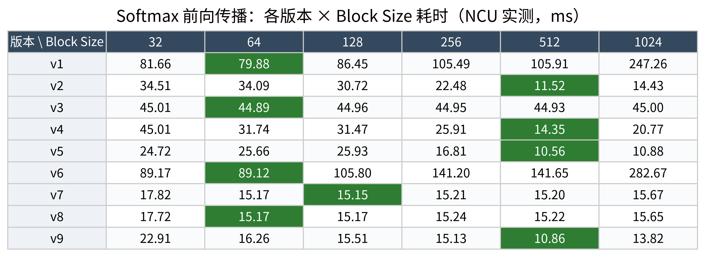
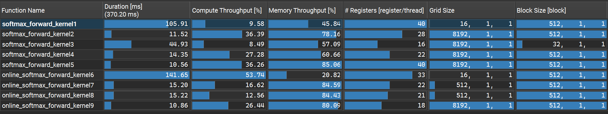

# Softmax Forward — CUDA 算子优化

从朴素的三趟遍历，到标准块级规约，再到在线 Softmax（Online Softmax），记录 Softmax 在 GPU 上的 9 个版本迭代过程。

---

## 算子简介

对输入矩阵的每一行独立做 Softmax 归一化，将一行任意实数转换为总和为 1、取值在 0~1 之间的概率分布，是 Transformer 注意力机制的核心算子。

输入 `inp` 维度为 `(N, C)`，其中 `N = B*T`（总 Token 数），`C` 为特征维度。

标准做法需要三趟遍历一行：

```
maxval = max(row)                  # 第一趟：求行内最大值（避免 exp 上溢）
sum    = Σ exp(row - maxval)       # 第二趟：计算指数并求和
out    = exp(row - maxval) / sum   # 第三趟：归一化写回
```

>数值稳定性：`exp(x)` 在 `x > 88` 时会上溢为 inf，因此先减去行内最大值再算指数，数学上等价，数值上稳定。

**访存特征**：当 `C = 50257`（GPT-2 词表维度）时，总输入张量约 1.6 GB，超 L2 缓存容量；数据逐行处理无复用，且需遍历多趟，是典型的**访存受限型算子（Memory-Bound）**，优化核心是减少全局内存往返、提升访存合并度与带宽利用率。

---

## 性能总览

> 本仓库测试基准全环境统一，所有性能数据均采集自 Nsight Compute（`ncu --set full --cache-control all`）。NCU 单次采集含硬件计数器采样开销，绝对耗时略高于干净执行，跨版本结论基于同口径下的相对比较与硬件利用率指标。（详见根目录 README）
>
> 默认测试配置：FP32，`N=8192`（`B=8`×`T=1024`），`C=50257`（模拟 GPT-2 输出层）。
>
> v3 固定 `block_size=32`（单 Warp），其余版本在 32~1024 间扫参。



### Block Size = 512 下的硬件指标



| 版本 | 核心实现 | 耗时 (ms) | Compute (%) | Memory (%) | 寄存器 | Grid Size | Occupancy |
|:---:|---|:---:|:---:|:---:|:---:|:---:|:---:|
| v1 | 单线程处理 1 行，朴素移植 | 105.91 | 9.58 | 45.84 | 40 | 16 | 100% |
| v2 | 单 Block 一行，共享内存二分规约 | 11.52 | 36.39 | 78.16 | 28 | 8192 | 100% |
| v3 | 单 Warp 一行，纯 Shuffle 规约 | 44.93 | 8.49 | 57.09 | 16 | 8192 | 50% |
| v4 | 两级规约（Warp Shuffle + 跨 Warp 共享内存） | 14.35 | 27.28 | 60.66 | 22 | 8192 | 100% |
| v5 | 两级规约 + 循环展开 + 读写分离 + 缓存优化 | 10.56 | 36.26 | 85.06 | 40 | 8192 | 100% |
| v6 | 在线 Softmax，朴素移植 | 141.65 | 53.74 | 20.82 | 33 | 16 | 100% |
| v7 | 在线 Softmax + 协作组，单 Warp 一行 | 15.20 | 16.62 | 84.59 | 22 | 512 | 100% |
| v8 | 在线 Softmax + 无分支 Shuffle | 15.22 | 12.56 | 84.43 | 21 | 512 | 100% |
| v9 | 在线 Softmax + 块级两级规约 | 10.86 | 26.44 | 80.09 | 18 | 8192 | 100% |


> **从 v1 到 v5，耗时从 105.91ms 降至 10.56ms，提升约 10 倍。**
> v5 与 v9 分别代表普通 Softmax 和在线 Softmax 的最优版本，此环境中两者性能相当。

---

## v1 — 朴素移植：单线程处理一行

最直接的 CPU 移植：每个线程独立处理一行 `C` 个元素，串行完成三趟遍历。

```cuda
__global__ void softmax_forward_kernel1(float* out, const float* inp, int N, int C) {
    int i = blockIdx.x * blockDim.x + threadIdx.x;
    if (i < N) {
        const float* inp_row = inp + i * C;
        float* out_row = out + i * C;

        // 第一趟：求行内最大值
        float maxval = -INFINITY;
        for (int j = 0; j < C; j++) {
            if (inp_row[j] > maxval) maxval = inp_row[j];
        }
        // 第二趟：计算 exp 并累加
        double sum = 0.0;
        for (int j = 0; j < C; j++) {
            out_row[j] = expf(inp_row[j] - maxval);
            sum += out_row[j];
        }
        // 第三趟：归一化
        for (int j = 0; j < C; j++) {
            out_row[j] /= (float)sum;
        }
    }
}
```

### 问题

1. **并行度严重不足**：每线程负责一行，N = B*T 不过 8192 个线程，而 GPU 有数十个 SM 且每个 SM 都可以驻留上千个线程。这点线程远填不满硬件。
2. **访存不合并**：相邻线程处理的行地址间隔 `C=50257` 个元素，Warp 内 32 个线程访问完全离散的地址，带宽利用率极低。
3. **长串行依赖**：单线程串行跑 5 万次循环，单线程内部强数据依赖，Warp 内部指令无法并行（ILP 难展开），无法靠指令级并行隐藏循环延迟。

> Compute Throughput 只有 12.43%，Memory Throughput 也只有 54.60%——既没吃满算力，也没吃满带宽。

<br>

---

## v2 — 单 Block 一行：共享内存二分规约

v1 的两个致命问题是并行度不足和访存不合并。

v2 改变任务划分方式：一个 Block 处理一行，块内所有线程协作分摊 C 个元素。

这样做同时解决两个问题：
1. 相邻线程访问连续地址（thread 0 读 x[0]、thread 1 读 x[1]……），访存自然合并；
2. Block 内 512 个线程一起算一行，并行度提升 512 倍。

### 实现逻辑
块内规约用经典的共享内存二分规约：每个线程先求自己负责部分的局部最大值，写入共享内存，然后每轮 stride 折半合并。

```cuda
__global__ void softmax_forward_kernel2(float* out, const float* inp, int N, int C) {
    extern __shared__ float shared[];
    int bid = blockIdx.x;
    int tid = threadIdx.x;
    const float* x = inp + bid * C;

    // 一、求最大值（共同分摊 + 共享内存二分规约）
    float maxval = -INFINITY;
    for (int i = tid; i < C; i += blockDim.x)
        maxval = fmaxf(maxval, x[i]);
    shared[tid] = maxval;
    __syncthreads();
    for (int stride = blockDim.x / 2; stride >= 1; stride /= 2) {
        if (tid < stride) shared[tid] = fmaxf(shared[tid], shared[tid + stride]);
        __syncthreads();
    }
    float offset = shared[0];

    // 二、计算指数并写回
    for (int i = tid; i < C; i += blockDim.x)
        out[bid * C + i] = expf(x[i] - offset);
    __syncthreads();

    // 三、求指数和（复用共享内存 + 二分规约）
    float sumval = 0.0f;
    for (int i = tid; i < C; i += blockDim.x)
        sumval += out[bid * C + i];
    shared[tid] = sumval;
    __syncthreads();
    for (int stride = blockDim.x / 2; stride >= 1; stride /= 2) {
        if (tid < stride) shared[tid] += shared[tid + stride];
        __syncthreads();
    }
    float sum = shared[0];

    // 四、归一化写回
    for (int i = tid; i < C; i += blockDim.x)
        out[bid * C + i] = out[bid * C + i] / sum;
}
```

### 效果

- 耗时从 v1 的 105.91ms 降到 **11.52ms**——约 9 倍提升。
- Memory Throughput 从 45.84% 提升到 78.16%——这是本次优化最大的收益来源。

### 现存问题

1. **共享内存二分规约同步开销大**：每轮 stride 都要 `__syncthreads()`，block_size=512 时需要 9 轮同步。
2. **中间结果写了又读**：第二趟把 exp 结果写到 `out`，第三趟又从 `out` 读回来求 sum，多一次全局内存往返。
3. **标量访存**：每次只加载 1 个 float（4 字节），访存指令数多，可通过向量化访存压缩指令数。
> 向量化访存是通用优化技术，本篇专注 softmax 本身的优化思路，所以不再展开

<br>

---

## v3 — 单 Warp 行级规约：纯寄存器通信的极简实现（规约机制的演示）

该版本仅用于介绍 warp 规约，采用「一个 Warp（32 线程）处理一行数据」的设计，全程使用 Warp Shuffle 指令完成行内规约，完全不使用共享内存，也没有块级同步操作。

### 设计思路

在块级共享内存规约的实现中，块内规约需要把中间值写入共享内存，每一轮规约都要执行一次 `__syncthreads()` 块级同步，既有共享内存的读写延迟，也有同步开销。

而 Warp Shuffle 是 GPU 的寄存器级原语：同一个 Warp 内的线程可以直接读取彼此寄存器中的值，不需要经过共享内存中转，无块级同步，理论上规约的延迟更低。

### 实现逻辑

Kernel 内的四步，每一步都是 32 线程跨步遍历一行数据，通过 Warp 内规约得到行级结果：

```cuda
__global__ void softmax_forward_kernel3(float* out, const float* inp, int N, int C) {
    int bid = blockIdx.x;
    int tid = threadIdx.x;       // 固定 blockDim.x = 32
    const float* x = inp + bid * C;

    // 1. 求行内最大值：线程跨步遍历 + Warp 内规约
    float maxval = -INFINITY;
    for (int i = tid; i < C; i += 32)
        maxval = fmaxf(maxval, x[i]);
    maxval = warpReduceMax(maxval);  // Warp 内 32 个局部最大值归约为一个
    float offset = __shfl_sync(0xFFFFFFFF, maxval, 0);  // 广播给所有线程

    // 2. 计算指数并写回
    for (int i = tid; i < C; i += 32)
        out[bid * C + i] = expf(x[i] - offset);

    // 3. 求指数和：同样的 Warp 规约
    float sumval = 0.0f;
    for (int i = tid; i < C; i += 32)
        sumval += out[bid * C + i];
    sumval = warpReduceSum(sumval);

    // 4. 归一化
    for (int i = tid; i < C; i += 32)
        out[bid * C + i] = out[bid * C + i] / sumval;
}
```

### 性能表现

在 C=50257、block=32 的配置下，单 Kernel 耗时 44.93ms。相比 v2 共享内存块级规约（block=512，耗时 11.52ms），**慢了约 4 倍**。

>这是个典型「局部最优 ≠ 全局最优」的演示。只看规约操作本身，Shuffle 寄存器通信确实比共享内存更快，但放在整个 Kernel 的尺度上，这个设计带来了更严重的硬件利用率问题。

| 硬件指标 | v2（block=512） | v3（block=32） |
|---|:---:|:---:|
| 每行协作线程数 | 512 | 32 |
| 每线程串行循环次数 | 50257/512 ≈ 98 | 50257/32 ≈ 1570 |
| 每个 Block 包含 Warp 数 | 16 个 | **1 个** |
| SM 占用率（Occupancy） | 100% | 50% |
| 显存带宽利用率 | 78.16% | 57.09% |
| 计算单元利用率 | 36.39% | 8.49% |

**分析三层原因：**

1. **每行并行度不足**

   v2 用 512 个线程一起算一行，每线程串行遍历约 98 个元素；v3 只有 32 个线程算一行，每线程串行遍历约 1570 个元素——相差 16 倍。

   循环内部有数据依赖（`maxval = fmaxf(maxval, x[i])`），每一轮都要等上一轮算完，串行链越长，延迟越难被其他指令或其他 Warp 掩盖。这是任务划分层面的根本问题。

2. **单 Warp Block 打不满 SM 调度槽**

   每个 SM 能同时驻留的 Block 数量有硬件上限。v3 每个 Block 只含 1 个 Warp，当 Block 数达到硬件上限时，SM 上活跃的 Warp 总数也只能到最大值的一半（实测 Occupancy 仅 50%，SM 的 warp slot 有一半空着）。

3. **两者叠加 → 访存延迟无法隐藏**

   GPU 隐藏访存延迟的手段是：一个 Warp 等内存时，SM 切换到另一个就绪 Warp 继续执行。

   v3 同时存在两个问题：活跃 Warp 总数只有 v2 的一半（第 2 点），且每个 Warp 的串行链又长 16 倍（第 1 点）。遇到访存时既没有足够多的其他 Warp 可切换，单个 Warp 内部也没有足够的独立指令来重叠，内存延迟暴露，带宽利用率从 78% 跌到 57%。Softmax 是访存受限算子，带宽上不去，性能就直接下降。

### 版本定位

这是一个**教学演示版本**，价值在于清晰展示 Warp 级规约的最简写法和核心思想。

如果要发挥 Warp Shuffle 规约的优势，正确的做法是 **将多个 Warp 打包进同一个 Block**（每个 Warp 各处理一行），既保留寄存器级规约的低延迟，又保证足够的 SM 占用率。参考 v7、v8。

<br>

---

## v4 — 块级两级规约

### 设计思路

v2 的共享内存二分规约需要把 block_size 个中间值全部写入共享内存，每轮都同步。v4 沿用 v2 的"一 Block 处理一行"划分，但把规约拆成两级：

- **第一级（Warp 内）**：32 个线程用 Shuffle 指令在寄存器内完成规约，不需要共享内存，也不需要块级同步。
- **第二级（跨 Warp）**：每个 Warp 的 lane 0 把结果写入共享内存（只需 warpsPerBlock 个 float），由 Block 主线程串行合并。

这样共享内存用量从 block_size 个降到 warpsPerBlock 个 float，块级同步次数也从 log2(block_size) 次降到 1 次。

```cuda
__global__ void softmax_forward_kernel4(float* out, const float* inp, int N, int C) {
    extern __shared__ float shared[];  // 大小 = warpsPerBlock * sizeof(float)
    int bid = blockIdx.x;
    int tid = threadIdx.x;
    int warpId = tid / 32;
    int laneId = tid % 32;
    int warpsPerBlock = blockDim.x / 32;  // 块内 warp 数量
    const float* x = inp + bid * C;

    // 求最大值：跨步分摊 + 两级规约
    float maxval = -INFINITY;
    for (int i = tid; i < C; i += blockDim.x)
        maxval = fmaxf(maxval, x[i]);
    maxval = warpReduceMax(maxval);       // 第一级：Warp 内 Shuffle
    if (laneId == 0) shared[warpId] = maxval;
    __syncthreads();
    if (tid == 0) {                       // 第二级：0 号线程串行合并
        float val = shared[0];
        for (int i = 1; i < warpsPerBlock; i++)
            val = fmaxf(val, shared[i]);
        shared[0] = val;
    }
    __syncthreads();
    float offset = shared[0];

    // 后续计算 exp、求 sum、归一化，复用同一套两级规约框架
    ...
}
```

### 共享内存用量对比

| | v2（共享内存二分） | v4（两级规约） |
|---|---|---|
| 共享内存 | block_size 个 float | warpsPerBlock 个 float |
| block=1024 时 | 1024 × 4B = 4 KB | 32 × 4B = 128 B |

>共享内存占用降低 32 倍，理论上 SM 可驻留更多 Block。

### 效果表现

耗时 14.35ms，比 v2 的 11.52ms **反而慢了**，Memory Throughput 从 78.16% 降到 60.66%。

### 为什么两级规约没有跑赢共享内存二分规约？

v2 和 v4 的宏观任务划分完全一致（1 Block 处理 1 行），差别只在规约机制。理论上两级规约应该更快，但实测反而更慢。原因在于：

1. **v2 的二分规约被编译器深度优化**：当 stride < 32 时，规约只在单个 Warp 内进行，编译器可以直接将其转为寄存器操作（和 Shuffle 等效），实际块级同步次数远低于理论上的 log2(block_size)。
2. **v4 引入了额外开销**：warpId/laneId 的整数计算、跨 Warp 写共享内存、主线程串行合并——在 C=50257 的大场景下，这些开销相对于 5 万次循环虽然不大，但也无法忽略。

> "两级规约一定更快"是有前提的——需要结合 C 的大小和编译器优化程度判断。在这个测试环境下，v2 的朴素二分规约反而被编译器优化到了极致。

### 版本定位

v4 是 v5 的**架构基础**。虽然两级规约本身没有跑赢 v2，但它大幅降低了共享内存占用，为后续 v5 的循环展开和计算合并提供了更干净的骨架。

<br>

---

## v5 — 高性能版

v5 在 v4 基础上做了 6 项优化：

1. **循环展开（UNROLL_FACTOR=8）**：减少循环控制指令，批量发射访存请求，用计算时间隐藏访存延迟。
2. **计算合并（省一趟全局读）**：计算 exp 写回的同时，在寄存器内直接累加局部 sum，省去一整趟读取 exp 结果的全局内存访问。
3. **共享内存分区**：`maxvals` / `sumvals` 独立两段，逻辑清晰，无覆盖风险。
4. **流式访存**：`__ldcs` 加载输入，输入和输出只读一次，不污染缓存。
5. **边界完善**：读操作用 `min(C-1, idx)` 钳位（重复读不影响 max/sum 结果），写操作严格 `if (idx < C)` 判断（越界写会破坏其他行）。
6. **读写分离**：先批量加载到寄存器、再集中计算写回，让编译器有充足的指令调度空间。

```cuda
// 第二趟：计算 exp + 写回 + 寄存器内局部求和（三合一）
float sumval = 0.0f;
for (int i = tid; i < C; i += blockDim.x * 8) {
    float reg_array[8];
    // 阶段 1：批量加载到寄存器
    #pragma unroll
    for (int u = 0; u < 8; u++)
        reg_array[u] = __ldcs(&x[min(C-1, i + u * blockDim.x)]);
    // 阶段 2：批量计算、写回、寄存器内累加
    #pragma unroll
    for (int u = 0; u < 8; u++) {
        if (i + u * blockDim.x < C) {
            float output = expf(reg_array[u] - offset);
            y[i + u * blockDim.x] = output;
            sumval += output;   // 省掉一趟全局内存读
        }
    }
}
```

### 效果

| 指标 | v4 | v5 | 变化 |
|---|:---:|:---:|:---:|
| 耗时 (ms) | 14.35 | **10.56** | **快26%** |
| Compute (%) | 27.28 | 36.26 | +33% |
| Memory (%) | 60.66 | **85.06** | +40% |

v5 是标准 Softmax 最优版本，Memory Throughput 达到 85.06%，接近 DRAM 带宽物理上限。

<br>

---

## v6 — 在线 Softmax 朴素移植

之前 v1~v5 是标准三趟法，需要把 exp 中间结果写回全局内存再读回来求 sum。

v6 引入**在线 Softmax**（基于论文《Online normalizer calculation for softmax》），将"求最大值"和"求指数和"合并到一次遍历中：

```cuda
__global__ void online_softmax_forward_kernel6(float* out, const float* inp, int N, int C) {
    int i = blockIdx.x * blockDim.x + threadIdx.x;
    if (i >= N) return;
    const float* inp_row = inp + i * C;
    float* out_row = out + i * C;

    // 一趟遍历同时求出全局最大值和指数总和
    double sum = 0.0;  // 维度C很大时，双精度可显著提升数值稳定性
    for (int j = 0; j < C; j++) {
        float maxval_prev = maxval;
        float current_val = inp_row[j];
        if (current_val > maxval) {
            maxval = current_val;
            sum = sum * expf(maxval_prev - maxval) + expf(current_val - maxval);
        } else {
            sum = sum + expf(current_val - maxval);
        }
    }
    for (int j = 0; j < C; j++)
        out_row[j] = expf(inp_row[j] - maxval) / sum;
}
```

数学等价性：全程只有加法和乘法，没有大数相消误差。相比三趟法，访存从 3 次降为 2 次（1 读输入 + 1 写输出）。

### 为什么省了一次访存反而更慢？

v6 耗时 141.65ms，比 v1 还慢。**根因是 expf 落在了串行依赖链上**：

```cuda
sum = sum * expf(maxval - bigger) + expf(x[i] - bigger);  // 每次迭代都依赖上一次的 sum
```

每一次迭代，`sum` 都要等上一次迭代的 `sum` 算完，而 `expf` 的延迟（约 20 个时钟周期）**完全落在串行链上**。对比 v1 的第二趟：

```cuda
out_row[j] = expf(inp_row[j] - maxval);  // expf 之间互相独立，可并行发射到 SFU
sum += out_row[j];                       // sum 链上只有一次加法（约 4 周期）
```

v1 里多个 `expf` 互相独立，可以并行发射；`sum` 的依赖链上只有加法。

v6 把 `expf` 的延迟强行串行化了——**用更多的计算延迟换更少的访存，在单线程模式下得不偿失**。（v6 里还存在数据依赖的分支（if current_val > maxval），在 Warp 内产生分歧，进一步拖慢执行。）

> v6 的价值是作为在线算法的基线，也证明了在线算法并非一定最优，最好配合足够的并行度来缩短串行链。

<br>

---

## v7 / v8 — 在线 Softmax 的 Warp 级并行

v6 的问题是每线程串行遍历 C 次。v7 改为**一个 Warp 处理一行**，32 个线程分摊 C 个元素，每线程处理 C/32 个元素，串行链缩短 32 倍。

核心数据结构 `SumMax` 把"局部最大值"和"基于该最大值的指数和"打包成 8 字节对齐结构体，通过 shuffle 一次性交换：

```cuda
struct __align__(8) SumMax { float maxval; float sum; };

__device__ SumMax reduce_sum_max_op(SumMax a, SumMax b) {
    // 选更大的 max 作为基准，较小基准下的 sum 折算过来
    float bigger = fmaxf(a.maxval, b.maxval);
    float sum = (a.maxval == bigger ? a.sum : a.sum * expf(a.maxval - bigger))
              + (b.maxval == bigger ? b.sum : b.sum * expf(b.maxval - bigger));
    return {bigger, sum};
}
```

v8 进一步用 `fmaxf` + 统一公式抹掉 v7 中的 if-else 分支：

```cuda
// v8 完整代码
__global__ void online_softmax_forward_kernel8(float* out, const float* inp, int N, int C) {
    const int warpsPerBlock = blockDim.x / warpSize;
    int tid = threadIdx.x;
    if (tid >= C) { return; }
    int warpId = tid / warpSize;
    int laneId = tid % warpSize;
    int row = blockIdx.x * warpsPerBlock + warpId;
    if (row >= N) { return; }

    const float* x = inp + row * C;
    float* const y = out + row * C;

    // v8 核心循环：无分支写法
    // 单趟循环同时维护 maxval 和 sumval
    float maxval = -INFINITY, sumval = 0.0f, bigger;
    for (int i = laneId; i < C; i += warpSize) {
        bigger = fmaxf(maxval, x[i]);
        sumval = sumval * expf(maxval - bigger) + expf(x[i] - bigger);
        maxval = bigger;
    }

    // Warp 内两两合并（基于 SumMax 结构的两级规约语义）
    float offsetMaxval, offsetSumval;
    for (int offset = warpSize / 2; offset > 0; offset >>= 1) {
        __syncwarp();
        offsetMaxval = __shfl_down_sync(0xFFFFFFFF, maxval, offset);
        offsetSumval = __shfl_down_sync(0xFFFFFFFF, sumval, offset);
        if (offsetMaxval > maxval) {
            sumval *= expf(maxval - offsetMaxval);
            maxval = offsetMaxval;
        } else {
            offsetSumval *= expf(offsetMaxval - maxval);
        }
        sumval += offsetSumval;
    }
    // 广播最终结果（向下规约后只有 lane 0 持有完整值，所以每个线程都读取 lane 0 的值）
    maxval = __shfl_sync(0xFFFFFFFF, maxval, 0);
    sumval = __shfl_sync(0xFFFFFFFF, sumval, 0);

    for (int i = laneId; i < C; i += warpSize) {
        y[i] = expf(x[i] - maxval) / sumval;
    }
}
```

### 效果

| 指标 | v6 | v7 | v8 |
|---|:---:|:---:|:---:|
| 耗时 (ms) | 141.65 | 15.20 | 15.22 |
| Compute (%) | 53.74 | 16.62 | 12.56 |
| Memory (%) | 20.82 | 84.59 | 84.43 |

从 v6 到 v7，耗时从 141.65ms 降到 15.20ms——9 倍提升。把 C 分摊到 32 个线程后，串行链缩短 32 倍，expf 延迟被完美隐藏。

### 为什么 v8 没有比 v7 更快？

v8 消除了 if-else 分支，但耗时与 v7 基本一致（差异在测量噪声内）。原因：
1. 本算子是访存受限，ALU 上多算一次 exp 被访存延迟完全隐藏。
2. 在线 Softmax 的 max 刷新天然稀疏（一行 5 万元素里真正刷新最大值的次数极少），if-else 分支高度可预测，发散开销本就很小。

> v8 的价值不是性能提升，而是验证了"无分支优化的适用边界"——它在计算密集 + 分支随机的场景才值钱，在访存密集 + 分支可预测的场景里则是被隐藏的多余运算。

### 为什么 Memory 84% 却比 v5 慢？

v7/v8 的 Memory Throughput（84.59%）和 v5（85.06%）几乎相同，但耗时多了 44%。关键在 **Grid Size**：

- v5：Grid = 8192（一个 Block 处理一行，512 线程并行）
- v7/v8：Grid = 512（一个 Block 内 16 个 Warp 各处理一行，32 线程并行）

v7/v8 的 Block 总数只有 v5 的 1/16，SM 上驻留的 Block 数不足。**Memory Throughput 百分比不是唯一指标，Grid Size 是否填满 SM 同样关键。**

<br>

---

## v9 — 在线 Softmax + 块级两级规约

v7/v8 每行只用 32 个线程，在 C=50257 这样的大 C 下每线程仍要处理 1570 个元素。v9 改用「1 个 Block 处理 1 行」，用整个 Block 的线程分摊长通道遍历。

```cuda
__global__ void online_softmax_forward_kernel9(float* out, const float* inp, int N, int C) {
    extern __shared__ SumMax shared_sm[];
    int bid = blockIdx.x;
    int tid = threadIdx.x;
    int warpId = tid / 32;
    int laneId = tid % 32;
    int warpsPerBlock = blockDim.x / 32;
    const float* x = inp + bid * C;

    // 1. 每线程累积局部 SumMax
    SumMax sm_partial = {-INFINITY, 0.0f};
    for (int i = tid; i < C; i += blockDim.x)
        sm_partial = reduce_sum_max_op(sm_partial, {x[i], 1.0f});

    // 2. Warp 内 shuffle 规约到 lane0
    SumMax sm_warp = sm_partial;
    for (int offset = 16; offset > 0; offset >>= 1) {
        SumMax other;
        other.maxval = __shfl_down_sync(0xFFFFFFFF, sm_warp.maxval, offset);
        other.sum    = __shfl_down_sync(0xFFFFFFFF, sm_warp.sum, offset);
        sm_warp = reduce_sum_max_op(sm_warp, other);
    }
    if (laneId == 0) shared_sm[warpId] = sm_warp;
    __syncthreads();

    // 3. 跨 Warp 规约：0 号线程串行合并
    if (tid == 0) {
        SumMax sm_total = shared_sm[0];
        for (int i = 1; i < warpsPerBlock; i++)
            sm_total = reduce_sum_max_op(sm_total, shared_sm[i]);
        shared_sm[0] = sm_total;
    }
    __syncthreads();

    // 4. 广播全局 maxval / sum，归一化写回
    float global_max = shared_sm[0].maxval;
    float global_sum = shared_sm[0].sum;
    for (int i = tid; i < C; i += blockDim.x)
        out[bid * C + i] = expf(x[i] - global_max) / global_sum;
}
```

共享内存仅需 `warpsPerBlock × sizeof(SumMax)` = 16 × 8B = 128 B，远小于 v2 的 2 KB。

### 效果

| 指标 | v7/v8 | v9 | 变化 |
|---|:---:|:---:|:---:|
| 耗时 (ms) | 15.20 | **10.86** | **-28%** |
| Compute (%) | 16.62 | 26.44 | +59% |
| Memory (%) | 84.59 | 80.09 | -5% |

v9 是在线 Softmax 的较优版本，与标准 Softmax 的 v5（10.56ms）性能基本持平。

这验证了在线 Softmax 的工程价值：在大 C 场景下，减少一次全局内存往返的收益，被块级并行充分发挥。

### 在线 Softmax 的真正价值：Flash Attention

独立算子场景下 v9 和 v5 打平，不代表它价值低。在线 Softmax 最大的意义不是省一趟访存，而是**它的数学形式能与 Flash Attention 融合**。

Flash Attention 的核心约束是 K/V 序列太长，整行 attention scores 放不进 SRAM，必须按 K/V 块流式处理。这就要求 Softmax 支持"边遍历边更新"：

Flash Attention 每个 Q tile 的执行流程：
```
  m = -inf, l = 0, O = 0
  for 每个 K/V tile：
      S = Q @ K_tile^T               # 当前块的 scores，只占整行的一部分
      m_new = max(m, rowmax(S))      # 在线更新 max
      P = exp(S - m_new)             # 当前块的概率
      l = l * exp(m - m_new) + rowsum(P)    # sum 折算到新基准
      O = O * exp(m - m_new) + P @ V_tile   # 输出也折算
      m = m_new
  O = O / l
```
这个 exp(m - m_new) 的折算项就是在线 Softmax 的核心公式。

普通三趟法做不到——它要求先读完整行求 max，再回来读求 sum，再回来归一化。

但在 Flash Attention 场景下，整行 K/V 根本不在 SRAM 里，每读一块都要从 HBM 重新拉，三趟就变成三趟 HBM 读写，Flash Attention 的意义就没了。

在线 Softmax 不只是"省一趟访存的优化技巧"，**它是 Flash Attention 能成立的数学前提**

<br>

---

## 优化路径总结

```
v1 (105.91ms)  单线程一行三趟，并行度不足 + 访存不合并
  ↓ 1 Block 一行，恢复合并访存
v2 (11.52ms)   共享内存二分规约 → 带宽利用率升至 78%
  ↓ 尝试 1 Warp 一行
v3 (44.93ms)   Block 太小，调度开销累积 → 反而更慢
  ↓ 回归 1 Block 一行 + 两级规约
v4 (14.35ms)   Warp Shuffle + 跨 Warp 共享内存，共享内存降 32 倍
  ↓ 循环展开 + 计算合并 + 流式访存
v5 (10.56ms)   Memory Throughput 85%，标准 Softmax 最优

v6 (141.65ms)  在线朴素版，expf 串行依赖暴露 → 反而更慢
  ↓ 改用 1 Warp 一行
v7 (15.20ms)   在线 Softmax Warp 级并行，串行链缩短 32 倍
v8 (15.22ms)   无分支写法，实测无收益（访存受限 + 分支可预测）
  ↓ 改用 1 Block 处理 1 行，两级规约
v9 (10.86ms)   在线 + 块级并行，以 2 趟访存追平三趟法
```

---

## 规律总结

1. **访存合并是第一优先级**：v1 到 v2 的 9 倍提升，本质是把"线程间地址隔 C 个元素"改成了"相邻线程访问连续地址"。地址连续性比任何算法优化都重要。
2. **Block 粒度要适中**：v3 每个 Block 只放 1 个 Warp（32 线程），Block 调度开销累积；v7/v8 每个 Block 放 16 个 Warp 各处理一行，才正确发挥了 Warp 级并行的优势。
3. **Memory Throughput 高 ≠ 一定快**：v7/v8 的 Memory Throughput（84%+）和 v5（85%）几乎相同，但 Grid 只有 512，总耗时多了 44%。带宽利用率百分比要结合 Grid Size / Occupancy 一起看。
4. **在线算法的收益取决于串行链长度**：v6（单线程）expf 串行依赖暴露，比三趟法还慢；v9（块级并行）每线程只处理 C/512 个元素，expf 延迟被隐藏，才追平标准三趟法。
5. **无分支优化有适用边界**：v8 消除了 if-else 分支但没有收益，因为访存受限算子的 ALU 空闲时间足够掩盖多余运算。优化手段要匹配瓶颈类型。

---

## 后续优化方向

1. **Float4 向量化访存**
   当前 v5/v9 仍是标量加载（4 字节/次），改为 `float4`（16 字节/次）可将访存指令数减至 1/4，进一步压榨带宽利用率。需处理 C 非 4 对齐的边界。

2. **算子融合：Flash Attention 思路**
   Softmax 天然出现在 Attention 的末尾。如果能与上游的 `Q @ K^T` 或下游的 `@ V` 融合，在 SRAM 中完成 `QK^T → softmax → V` 的流水线，就能彻底消除中间 attention score 张量的全局内存往返，比独立 Softmax 算子快。

3. **低精度支持**
   当前基于 FP32。若改为 BF16/FP16，数据量减半，DRAM 流量减半，理论上可获得近 2 倍带宽收益。累加 sum 时仍需用 FP32 保持数值稳定。
