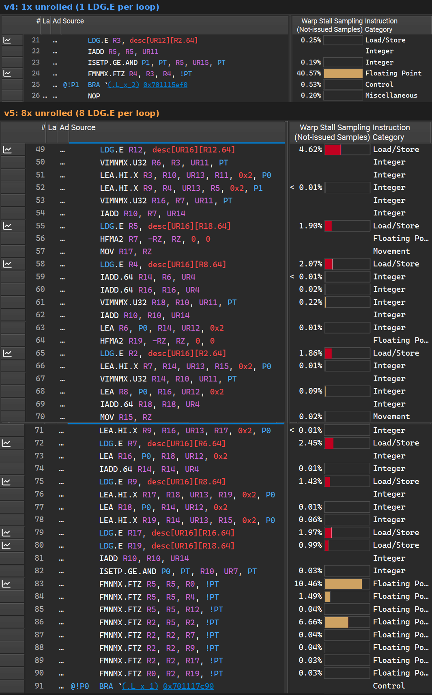
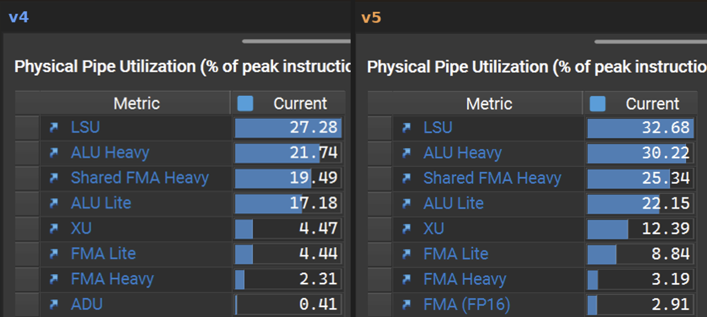
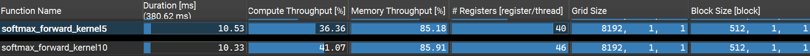
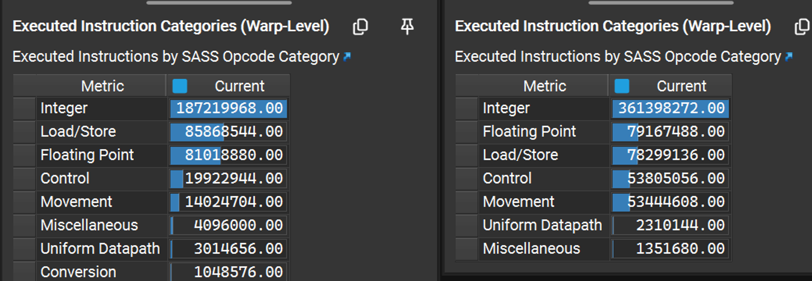
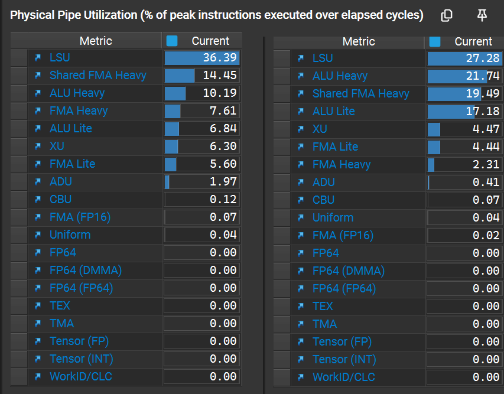
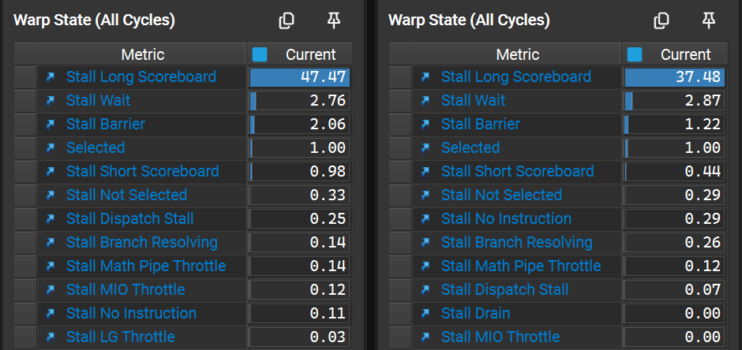
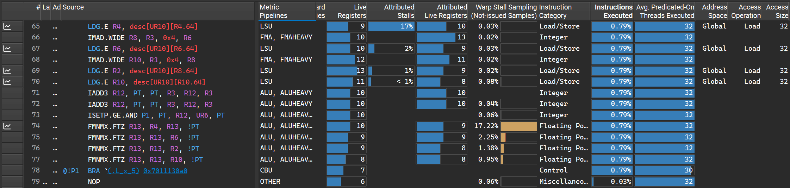
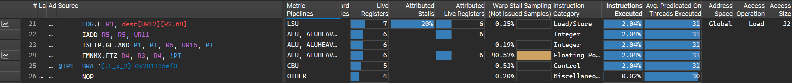
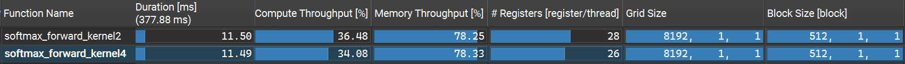

# Softmax Forward — CUDA 算子优化

从朴素的三趟遍历，到标准块级规约，再到在线 Softmax（Online Softmax），记录 Softmax 在 GPU 上的 9 个版本迭代过程。

---

## 算子简介

对输入矩阵的每一行独立做 Softmax 归一化，将一行任意实数转换为总和为 1、取值在 0~1 之间的概率分布，是 Transformer 注意力机制的核心算子。

输入 `inp` 维度为 `(N, C)`，其中 `N = B*T`（总 Token 数），`C` 为特征维度。

标准做法需要三趟遍历一行：

```
maxval = max(row)                  # 第一趟：求行内最大值（避免 exp 上溢）
sum    = Σ exp(row - maxval)       # 第二趟：计算指数并求和
out    = exp(row - maxval) / sum   # 第三趟：归一化写回
```

>数值稳定性：`exp(x)` 在 `x > 88` 时会上溢为 inf，因此先减去行内最大值再算指数，数学上等价，数值上稳定。

典型的**访存受限型算子（Memory-Bound）**。三趟遍历逐行读输入，每行数据只读一次无复用，计算量（max + exp + 除法）很少，核心优化目标是**减少全局内存往返、提升访存合并度与带宽利用率**。

---

## 性能总览

> 本仓库测试基准全环境统一，所有性能数据均采集自 Nsight Compute（`ncu --set full --cache-control all`）。NCU 单次采集含硬件计数器采样开销，绝对耗时略高于干净执行，跨版本结论基于同口径下的相对比较与硬件利用率指标。（详见根目录 README）
>
> 默认测试配置：FP32，`N=8192`（`B=8`×`T=1024`），`C=50257`（模拟 GPT-2 输出层）。
>
> v3 固定 `block_size=32`（单 Warp），其余版本在 32~1024 间扫参。


### Block Size = 512 下的硬件指标


| 版本 | 核心实现 | 耗时 (ms) | Compute (%) | Memory (%) | 寄存器 | Grid Size | Occupancy |
|:---:|---|:---:|:---:|:---:|:---:|:---:|:---:|
| v1 | 单线程处理 1 行，朴素移植 | 105.91 | 9.58 | 45.84 | 40 | 16 | 100% |
| v2 | 单 Block 一行，共享内存二分规约 | 11.52 | 36.39 | 78.16 | 28 | 8192 | 100% |
| v3 | 单 Warp 一行，纯 Shuffle 规约 | 44.93 | 8.49 | 57.09 | 16 | 8192 | 50% |
| v4 | 两级规约（Warp Shuffle + 跨 Warp 共享内存） | 14.35 | 27.28 | 60.66 | 22 | 8192 | 100% |
| v5 | 两级规约 + 循环展开 + 读写分离 + 缓存优化 | 10.56 | 36.26 | 85.06 | 40 | 8192 | 100% |
| v6 | 在线 Softmax，朴素移植 | 141.65 | 53.74 | 20.82 | 33 | 16 | 100% |
| v7 | 在线 Softmax + 协作组，单 Warp 一行 | 15.20 | 16.62 | 84.59 | 22 | 512 | 100% |
| v8 | 在线 Softmax + 手写 Shuffle 规约 | 15.22 | 12.56 | 84.43 | 21 | 512 | 100% |
| v9 | 在线 Softmax + 块级两级规约 | 10.86 | 26.44 | 80.09 | 18 | 8192 | 100% |


> **从 v1 到 v5，耗时从 105.91ms 降至 10.56ms，提升约 10 倍。**
> v5 与 v9 分别代表普通 Softmax 和在线 Softmax 的最优版本，此环境中两者性能相当。

---

## v1 — 朴素移植：单线程处理一行

最直接的 CPU 移植：每个线程独立处理一行 `C` 个元素，串行完成三趟遍历。

```cuda
__global__ void softmax_forward_kernel1(float* out, const float* inp, int N, int C) {
    int i = blockIdx.x * blockDim.x + threadIdx.x;
    if (i < N) {
        const float* inp_row = inp + i * C;
        float* out_row = out + i * C;

        // 第一趟：求行内最大值
        float maxval = -INFINITY;
        for (int j = 0; j < C; j++) {
            if (inp_row[j] > maxval) maxval = inp_row[j];
        }
        // 第二趟：计算 exp 并累加
        double sum = 0.0;
        for (int j = 0; j < C; j++) {
            out_row[j] = expf(inp_row[j] - maxval);
            sum += out_row[j];
        }
        // 第三趟：归一化
        for (int j = 0; j < C; j++) {
            out_row[j] /= (float)sum;
        }
    }
}
```

### 问题

1. **并行度严重不足**：每线程负责一行，N = B*T 不过 8192 个线程，而 GPU 有数十个 SM 且每个 SM 都可以驻留上千个线程。这点线程远填不满硬件。
2. **访存不合并**：相邻线程处理的行地址间隔 `C=50257` 个元素，Warp 内 32 个线程访问完全离散的地址，带宽利用率极低。
3. **长串行依赖**：单线程串行跑 5 万次循环，单线程内部强数据依赖，Warp 内部指令无法并行（ILP 难展开），无法靠指令级并行隐藏循环延迟。

> Compute Throughput 只有 12.43%，Memory Throughput 也只有 54.60%——既没吃满算力，也没吃满带宽。

<br>

---

## v2 — 单 Block 一行：共享内存二分规约

v1 的两个致命问题是并行度不足和访存不合并。

v2 改变任务划分方式：一个 Block 处理一行，块内所有线程协作分摊 C 个元素。

这样做同时解决两个问题：
1. 相邻线程访问连续地址（thread 0 读 x[0]、thread 1 读 x[1]……），访存自然合并；
2. Block 内 512 个线程一起算一行，并行度提升 512 倍。

### 实现逻辑
块内规约用经典的共享内存二分规约：每个线程先求自己负责部分的局部最大值，写入共享内存，然后每轮 stride 折半合并。

```cuda
__global__ void softmax_forward_kernel2(float* out, const float* inp, int N, int C) {
    extern __shared__ float shared[];
    int bid = blockIdx.x;
    int tid = threadIdx.x;
    const float* x = inp + bid * C;

    // 一、求最大值（共同分摊 + 共享内存二分规约）
    float maxval = -INFINITY;
    for (int i = tid; i < C; i += blockDim.x)
        maxval = fmaxf(maxval, x[i]);
    shared[tid] = maxval;
    __syncthreads();
    for (int stride = blockDim.x / 2; stride >= 1; stride /= 2) {
        if (tid < stride) shared[tid] = fmaxf(shared[tid], shared[tid + stride]);
        __syncthreads();
    }
    float offset = shared[0];

    // 二、计算指数并写回
    for (int i = tid; i < C; i += blockDim.x)
        out[bid * C + i] = expf(x[i] - offset);
    __syncthreads();

    // 三、求指数和（复用共享内存 + 二分规约）
    float sumval = 0.0f;
    for (int i = tid; i < C; i += blockDim.x)
        sumval += out[bid * C + i];
    shared[tid] = sumval;
    __syncthreads();
    for (int stride = blockDim.x / 2; stride >= 1; stride /= 2) {
        if (tid < stride) shared[tid] += shared[tid + stride];
        __syncthreads();
    }
    float sum = shared[0];

    // 四、归一化写回
    for (int i = tid; i < C; i += blockDim.x)
        out[bid * C + i] = out[bid * C + i] / sum;
}
```

### 效果

- 耗时从 v1 的 105.91ms 降到 **11.52ms**——约 9 倍提升。
- Memory Throughput 从 45.84% 提升到 78.16%——本次优化最大的收益来源。

### 现存问题

1. **共享内存二分规约同步开销大**：每轮 stride 都要 `__syncthreads()`，block_size=512 时需要 9 轮同步。
2. **中间结果写了又读**：第二趟把 exp 结果写到 `out`，第三趟又从 `out` 读回来求 sum，多一次全局内存往返。
3. **标量访存**：每次只加载 1 个 float（4 字节），访存指令数多，可通过向量化访存压缩指令数。
> 向量化访存是通用优化技术，residual 目录里已有介绍，本篇专注 softmax 本身的优化路径，所以不再展开

<br>

---

## v3 — 单 Warp 行级规约：纯寄存器通信的极简实现（规约机制演示）

该版本仅用于介绍 warp 规约，采用「一个 Warp（32 线程）处理一行数据」的设计，全程使用 Warp Shuffle 指令完成行内规约，完全不用共享内存，没有块级同步。

### 设计思路

在块级共享内存规约的实现中，块内规约需要把中间值写入共享内存，每一轮规约都要执行一次 `__syncthreads()` 块级同步，既有共享内存的读写延迟，也有同步开销。

而 Warp Shuffle 是 GPU 的寄存器级原语：同一个 Warp 内的线程可以直接读取彼此寄存器中的值，不需要经过共享内存中转，无块级同步，理论上规约的延迟更低。

### 实现逻辑

Kernel 内的四步，每一步都是 32 线程跨步遍历一行数据，通过 Warp 内规约得到行级结果：

```cuda
__global__ void softmax_forward_kernel3(float* out, const float* inp, int N, int C) {
    int bid = blockIdx.x;
    int tid = threadIdx.x;       // 固定 blockDim.x = 32
    const float* x = inp + bid * C;

    // 1. 求行内最大值：线程跨步遍历 + Warp 内规约
    float maxval = -INFINITY;
    for (int i = tid; i < C; i += 32)
        maxval = fmaxf(maxval, x[i]);
    maxval = warpReduceMax(maxval);  // Warp 内 32 个局部最大值归约为一个
    float offset = __shfl_sync(0xFFFFFFFF, maxval, 0);  // 广播给所有线程

    // 2. 计算指数并写回
    for (int i = tid; i < C; i += 32)
        out[bid * C + i] = expf(x[i] - offset);

    // 3. 求指数和：同样的 Warp 规约
    float sumval = 0.0f;
    for (int i = tid; i < C; i += 32)
        sumval += out[bid * C + i];
    sumval = warpReduceSum(sumval);

    // 4. 归一化
    for (int i = tid; i < C; i += 32)
        out[bid * C + i] = out[bid * C + i] / sumval;
}
```

### 性能表现

在 C=50257、block=32 的配置下，单 Kernel 耗时 44.93ms。相比 v2 共享内存块级规约（block=512，耗时 11.52ms），**慢了约 4 倍**。

>这是个典型「局部最优 ≠ 全局最优」的演示。只看规约操作本身，Shuffle 寄存器通信确实比共享内存更快，但放在整个 Kernel 的尺度上，这个设计带来了更严重的硬件利用率问题。

| 硬件指标 | v2（block=512） | v3（block=32） |
|---|:---:|:---:|
| 每行协作线程数 | 512 | 32 |
| 每线程串行循环次数 | 50257/512 ≈ 98 | 50257/32 ≈ 1570 |
| 每个 Block 包含 Warp 数 | 16 个 | **1 个** |
| SM 占用率（Occupancy） | 100% | 50% |
| 显存带宽利用率 | 78.16% | 57.09% |
| 计算单元利用率 | 36.39% | 8.49% |

**分析三层原因：**

1. **每行并行度不足**

   v2 用 512 个线程一起算一行，每线程串行遍历约 98 个元素；v3 只有 32 个线程算一行，每线程串行遍历约 1570 个元素——相差 16 倍。

   循环内部有数据依赖（`maxval = fmaxf(maxval, x[i])`），每轮都要等上一轮算完，串行链越长，延迟越难被其他指令或其他 Warp 掩盖。

2. **单 Warp Block 打不满 SM 调度槽**

   SM 能同时驻留的 Block 数量有硬件上限。v3 每个 Block 只含 1 个 Warp，当 Block 数达到硬件上限时，SM 上的 Warp 总数也只能到最大值的一半（实测 Occupancy 仅 50%，SM 的 warp slot 有一半空着）。

3. **两者叠加 → 访存延迟无法隐藏**

   GPU 隐藏访存延迟的手段是：一个 Warp 等内存时，SM 切换到另一个就绪 Warp 继续执行。

   v3 同时存在两个问题：活跃 Warp 总数只有 v2 的一半（第 2 点），且每个 Warp 的串行链又长 16 倍（第 1 点）。遇到访存时既没有足够多的其他 Warp 可切换，单个 Warp 内部也没有足够的独立指令来重叠，内存延迟暴露，带宽利用率只有 57%。

### 版本定位

这是一个**教学演示版本**，价值在于清晰展示 Warp 级规约的核心思想和最简写法。

如果要发挥 Warp Shuffle 规约的优势，正确的做法是 **将多个 Warp 打包进同一个 Block**（每个 Warp 各处理一行），既保留寄存器级规约的低延迟，又保证足够的 SM 占用率。参考 v7、v8。

<br>

---

## v4 — 块级两级规约

### 设计思路

v2 的共享内存二分规约有两个开销：每个线程都要把局部结果写进共享内存（block_size 个 float），每轮 stride 都要 __syncthreads() 块级同步。

v4 沿用 v2 的"1 Block 处理一行"划分，但把规约拆成两级：

- **第一级（Warp 内）**：32 个线程用 Shuffle 指令在寄存器内完成规约，不需要共享内存，也没有块级同步。
- **第二级（跨 Warp）**：每个 Warp 的 lane 0 把结果写入共享内存（只需 warpsPerBlock 个 float），由 thread 0 读出来合并。

这样共享内存用量从 block_size 个降到 warpsPerBlock 个 float，块级同步次数从 O(log₂(block_size)) 次降到 O(1) 次

```cuda
__global__ void softmax_forward_kernel4(float* out, const float* inp, int N, int C) {
    extern __shared__ float shared[];  // 大小 = warpsPerBlock * sizeof(float)
    int bid = blockIdx.x;
    int tid = threadIdx.x;
    int warpId = tid / 32;
    int laneId = tid % 32;
    int warpsPerBlock = blockDim.x / 32;  // 块内 warp 数量
    const float* x = inp + bid * C;

    // 求最大值：跨步分摊 + 两级规约
    float maxval = -INFINITY;
    for (int i = tid; i < C; i += blockDim.x)
        maxval = fmaxf(maxval, x[i]);
    maxval = warpReduceMax(maxval);       // 第一级：Warp 内 Shuffle（5 轮，零共享内存，零块级同步）
    if (laneId == 0) shared[warpId] = maxval;
    __syncthreads();
    if (tid == 0) {                       // 第二级：0 号线程串行合并（只写 16 个值，而非 512 个）
        float val = shared[0];
        for (int i = 1; i < warpsPerBlock; i++)
            val = fmaxf(val, shared[i]);
        shared[0] = val;
    }
    __syncthreads();
    float offset = shared[0];

    // 后续计算 exp、求 sum、归一化，复用同一套两级规约框架
    ...
}
```

### 与 v2 对比

| | v2（共享内存二分规约） | v4（两级规约） |
|---|---|---|
| 共享内存用量 | block_size 个 float | warpsPerBlock 个 float |
| block=512 时 | 512 × 4B = 2 KB | 16 × 4B = **64 B（省 32 倍）** |
| Warp 内规约路径 | LDS/STS 共享内存读写 | Shuffle 寄存器通信（延迟更低） |
| Warp 内规约次数 | 9 轮（活跃线程数逐轮减半） | 5 轮（全 Warp 参与） |
| 跨 Warp 同步次数 | 9 次 `__syncthreads()` | 2 次 `__syncthreads()` |
| 共享内存 Bank Conflict | 每轮多线程并发写，有冲突 | 只有 lane 0 写，无冲突 |

### 效果

耗时 14.35ms，反而不如 v2 的 11.52ms，不是算法本身问题，具体原因分析放在末尾，详见「附录：v4 为什么比 v2 慢」

### 版本定位

v4 是 v2 的算法优化版，它降低了共享内存占用，也为下面的 v5 版提供了干净的骨架。

<br>

---

## v5 — 高性能版

### 设计思路

v4 还有三个可优化的点：循环控制指令多、exp 结果写了又读、标量访存指令数多。v5 围绕这三点做了 6 项优化：

1. **循环展开**：减少循环控制指令，批量发射访存请求，用计算时间隐藏访存延迟。
2. **计算合并（省一趟全局读）**：计算 exp 写回的同时，在寄存器内直接累加局部 sum，不再把 exp 结果写回全局内存后再读回来求 sum。
3. **共享内存分区**：`maxvals`/`sumvals` 独立两段，逻辑清晰，防覆盖。
4. **流式访存**：`__ldcs` 加载只读一次的输入，避免污染缓存。
5. **边界处理**：读操作用 `min(C-1, idx)` 钳位（重复读不影响 max/sum 结果），写操作严格 `if (idx < C)` 判断（越界写会破坏其他行）。
6. **读写分离**：先批量加载到寄存器、再集中计算写回，让编译器有充足的指令调度空间。

```cuda
__global__ void softmax_forward_kernel5(float* out, const float* inp, int N, int C) {
    // 优化点3：共享内存分区，max/sum 各一段
    __shared__ float maxvals[WARPS_PER_BLOCK];
    __shared__ float sumvals[WARPS_PER_BLOCK];

    int tid = threadIdx.x;
    int warpId = tid / 32, laneId = tid % 32;
    const float* x = inp + blockIdx.x * C;
    float* y = out + blockIdx.x * C;

    // ----- 第一趟：求最大值（8x 展开）-----
    float maxval = -INFINITY;
    for (int i = tid; i < C; i += blockDim.x * 8) {
        float reg[8];
        #pragma unroll
        for (int u = 0; u < 8; u++)
            reg[u] = __ldcs(&x[min(C-1, i + u * blockDim.x)]);  // 优化点4+5
        #pragma unroll
        for (int u = 0; u < 8; u++)
            maxval = fmaxf(maxval, reg[u]);
    }
    maxval = warpReduceMax(maxval);  // v4 的两级规约
    if (laneId == 0) maxvals[warpId] = maxval;
    __syncthreads();
    if (tid == 0) {
        float val = maxvals[0];
        for (int i = 1; i < WARPS_PER_BLOCK; i++) val = fmaxf(val, maxvals[i]);
        maxvals[0] = val;
    }
    __syncthreads();
    float offset = maxvals[0];

    // ----- 第二趟：exp + 写回 + 寄存器内局部求和（三合一）-----
    float sumval = 0.0f;
    for (int i = tid; i < C; i += blockDim.x * 8) {
        float reg_array[8];
        // 优化点6：先批量加载到寄存器
        #pragma unroll
        for (int u = 0; u < 8; u++)
            reg_array[u] = __ldcs(&x[min(C-1, i + u * blockDim.x)]);
        // 优化点2：批量计算、写回、寄存器内累加（省一趟全局读）
        #pragma unroll
        for (int u = 0; u < 8; u++) {
            if (i + u * blockDim.x < C) {
                float output = expf(reg_array[u] - offset);
                y[i + u * blockDim.x] = output;
                sumval += output;
            }
        }
    }
    // 规约 sumval（和 maxval 同样的两级规约）
    sumval = warpReduceSum(sumval);
    if (laneId == 0) sumvals[warpId] = sumval;
    __syncthreads();
    if (tid == 0) {
        float val = sumvals[0];
        for (int i = 1; i < WARPS_PER_BLOCK; i++) val += sumvals[i];
        sumvals[0] = val;
    }
    __syncthreads();
    float total_sum = sumvals[0];

    // ----- 第三趟：归一化（8x 展开）-----
    for (int i = tid; i < C; i += blockDim.x * 8) {
        #pragma unroll
        for (int u = 0; u < 8; u++) {
            int idx = i + u * blockDim.x;
            if (idx < C) y[idx] /= total_sum;
        }
    }
}
```

### 性能表现

| 指标 | 耗时 (ms) | Memory Throughput (%) | Compute Throughput (%) |
|---|:---:|:---:|:---:|
| v4 | 14.35 | 60.66 | 27.28 |
| v5 | **10.56** | **85.06** | 36.26 |

8x 循环展开让编译器批量发射 load，计算合并省掉了一整趟全局内存读 exp 结果。Memory Throughput 从 60% 拉到 85%，DRAM 带宽进一步吃满。

**下图是两个 kernel 求 max 循环的 SASS 对比：**



- **v4（上半部分）**：一个循环体只有 1 个 LDG.E（行 21），发完 load 要等数据回来才能算 FMNMX（浮点取最值指令），然后再加计数器、判断分支，才能发下一个 load。每次只有 1 个内存请求在飞。
- **v5（下半部分）**：一个循环体连续发射 8 个 LDG.E（行 49、55、58、65、72、75、79、80），然后连续做 8 次 FMNMX。编译器一次性发出 8 个内存请求，中间的地址计算（LEA/IADD）穿插在 load 之间，不影响发射节奏。

这是 v5 带宽从 60% 跳到 85% 的根本原因（v4 输给 v2 也是编译器展开的原因，详见附录）。

**管线利用率截图，左边 v4，右边 v5：**

>GPU 内部各条执行流水线的繁忙程度，百分比 = 实际指令发射速度 / 该管线的峰值速度。



| 指标 | LSU 管线利用率 | ALU Heavy 管线利用率 |
|---|:---:|:---:|
| v4 | 27% | 22% |
| v5 | 33% | 30% |

管线利用率的变化和 SASS 证据一致：v5 的访存管线更忙了——8 个 load 一起发，单位时间内搬运的数据更多。计算管线也更忙了——同样的计算量在更短时间里完成。

>v5 的内存带宽已到 85%，但访存管线才用了 33%——说明瓶颈在 DRAM 带宽本身，不在 GPU 算力。

### 版本定位

这是**普通 softmax 的最优版本**。在不改变算法结构（遍历三趟全局内存）的前提下，通过循环展开、计算合并和流式访存等，让带宽利用率靠近硬件极限。

在寄存器压力范围内，通过调整循环展开因子的小大，或配合向量化访存技术，往往还能**进一步**压榨带宽。

<br>

---

## 额外对比实验：v10 — 二分规约 vs 两级规约

v5 用的是 v4 的**两级规约**骨架（Warp Shuffle + 跨 Warp 共享内存）。

v10 则在 v2 的**共享内存二分规约**的骨架基础上，运用同样的优化（8x 展开、计算合并、`__ldcs`、读写分离、边界处理）。两个 kernel 唯一的区别就是规约机制。

```cuda
// v5  = v4 骨架（两级规约） + 循环展开 + 计算合并 + 读写分离 + __ldcs
// v10 = v2 骨架（二分规约） + 循环展开 + 计算合并 + 读写分离 + __ldcs
// 除了骨架不同，优化手段与 v5 完全一致

// 两版共同的主循环：8x 展开 + __ldcs + 计算合并 + 读写分离
float sumval = 0.0f;
for (int i = tid; i < C; i += block_size * 8) {
    float reg[8];
    // 阶段 1：批量加载到寄存器（8x 展开，一次发 8 个 load）
    #pragma unroll
    for (int u = 0; u < 8; u++)
        reg[u] = __ldcs(&x[min(C-1, i + u * block_size)]);
    // 阶段 2：批量计算、写回、寄存器内累加 sum（省一趟全局读）
    #pragma unroll
    for (int u = 0; u < 8; u++) {
        if (i + u * block_size < C) {
            float output = expf(reg[u] - offset);
            y[i + u * block_size] = output;
            sumval += output;
        }
    }
}

// 唯一区别是规约方式：
// v10：二分规约（全 Block 共享内存）
shared[tid] = maxval;
__syncthreads();
for (int stride = block_size / 2; stride >= 1; stride /= 2) {
    if (tid < stride)
        shared[tid] = fmaxf(shared[tid], shared[tid + stride]);
    __syncthreads();
}
float offset = shared[0];

// sum 的规约同理...
```

### 性能表现



| 版本 | 耗时 (ms) | Memory Throughput (%) | Compute Throughput (%) | Registers |
|---|:---:|:---:|:---:|:---:|
| v5（两级规约） | 10.53 | 85.18 | 36.36 | 40 |
| v10（二分规约） | 10.33 | 85.91 | 41.07 | 46 |

两者性能基本相同（差距在测速误差范围内），Memory Throughput 都在 85% 左右，卡在同一个带宽天花板。

**结论：当两个 kernel 都被正确展开、带宽都吃满后，规约机制的差异对性能没有太多影响。** 规约只处理 block_size 个标量，在全局内存读写（50257 个值）面前占比极小，机制差异几乎被带宽瓶颈淹没。

>这呼应了末尾附录的结论：v4 比 v2 慢的原因是编译器没展开 v4，不是两级规约算法本身有问题。

<br>

---

## v6 — 在线 Softmax 朴素移植

### 数学原理

标准三趟法要求先知道整行最大值才能算 sum。

**在线 Softmax**（基于论文《Online normalizer calculation for softmax》）的核心是：**边遍历边维护当前已知的 max 和 sum，遇到更大的值时把旧 sum 折算到新基准上。**

假设已处理完前 $k$ 个元素，当前记录的最大值为 $m_k$，指数和为 $l_k = \sum_{i=1}^{k} e^{x_i - m_k}$。

读到第 $k+1$ 个元素 $x_{k+1}$ 时：

1. 更新最大值： 
    $m_{k+1}$ = max($m_k$, $x_{k+1}$)
2. 折算旧 sum： 
    $l_k$ × exp($m_k$ - $m_{k+1}$)
3. 累加新元素： 
    $l_{k+1}$ = $l_k$ × exp($m_k$ - $m_{k+1}$) + exp($x_{k+1}$ - $m_{k+1}$)

这样不需要提前知道整行最大值，一次遍历就能同时得到 max 和 sum。最后写回时用 $e^{x_i - m} / l$ 归一化即可。

### 设计思路

v1~v5 的三趟法要求 exp 的中间结果先写全局内存、再读回来求 sum，多一次全局内存往返。

在线 Softmax 的工程价值在于：利用上面的递推式，把"求 max"和"求 sum"合并到同一次输入遍历中，省去了 exp 中间结果的全局内存读写。访存从 3 次（读输入求 max、读输入算 exp 写回、读 exp 求 sum）降为 2 次（读输入边遍历边算、写输出归一化）。

```cuda
__global__ void online_softmax_forward_kernel6(float* out, const float* inp, int N, int C) {
    int i = blockIdx.x * blockDim.x + threadIdx.x;
    if (i >= N) return;
    const float* inp_row = inp + i * C;
    float* out_row = out + i * C;

    float maxval = -INFINITY;   // 当前已知的最大值
    double sum = 0.0;           // 基于 maxval 的指数和（双精度累加保稳定）

    // 一趟遍历：边读边维护 maxval 和 sum
    for (int j = 0; j < C; j++) {
        float maxval_prev = maxval;
        float current_val = inp_row[j];
        if (current_val > maxval) {
            // 遇到更大的值：更新 max，旧 sum 乘 exp(旧max-新max) 折算到新基准
            maxval = current_val;
            sum = sum * expf(maxval_prev - maxval) + expf(current_val - maxval);
        } else {
            // 没更大：直接累加
            sum += expf(current_val - maxval);
        }
    }

    // 第二趟：归一化写回
    for (int j = 0; j < C; j++)
        out_row[j] = expf(inp_row[j] - maxval) / sum;
}
```

### 性能表现

和 v1 一样，v6 也是一个线程处理一整行 C=50257 个元素，并行度只有 N=8192 个线程。耗时 141.65ms——比 v1（105.91ms）还慢。

### 为什么省了一次访存反而更慢？

原因是 **expf 落在串行依赖链上**，内核从**访存受限**变成**计算延迟受限**。看 v6 的核心循环：

```cuda
sum = sum * expf(maxval_prev - maxval) + expf(current_val - maxval);
```

`sum` 是一个累加器，每次循环迭代都必须等上一次的 `sum` 完全计算完毕，这就形成了一个贯穿整个 C=50257 次循环的单链串行依赖。而 `expf` 是一个高延迟的函数，这个延迟完全暴露在串行链上。

对比 v1 的第二趟：

```cuda
out_row[j] = expf(inp_row[j] - maxval);  // expf 之间互相独立，可并行发射到 SFU
sum += out_row[j];                       // 依赖链极短（1 次加法仅约 4 周期）
```

v1 里多个 `expf` 互相独立没有依赖，可以启动指令级并行（ILP），并行发射到 SFU 流水线；

虽然 `sum += out_row[j]` 也是串行，但加法指令延迟很低，且 `sum` 依赖的是上一个 `expf` 的结果，不会阻塞新的 `expf` 发射。

此外，`if (current_val > maxval)` 分支判断在 Warp 内会产生控制发散，Warp 被迫串行执行两个分支，进一步拖慢速度。

> v6 是在线算法的基准，它演示原理，也证明减少1次访存的收益需要足够的并行度来兑现。

<br>

---

## v7 / v8 — 在线 Softmax 的 Warp 级并行

v6 的问题是每线程串行遍历 C 次。v7/v8 改为**一个 Warp 处理一行**，32 个线程分摊 C 个元素，串行链缩短 32 倍。

#### 工具函数

在线 Softmax 规约时，每个线程局部维护两个值：自己看到的最大值，和基于这个最大值算出的指数和。两个线程的 max 不同，sum 不能直接相加，合并时要把较小基准下的 sum 折算到较大基准上。

`SumMax` 就是把这两个值打包成 8 字节结构体，方便通过一次 shuffle 同时交换；

`reduce_sum_max_op` 负责把两个 SumMax 合并成一个，逻辑和在线递推公式一致：

```cuda
struct __align__(8) SumMax {
    float maxval;  // 局部最大值
    float sum;     // 基于该最大值的指数和
};

// 合并两个 SumMax (a, b)，得到统一基准下的新 SumMax。
// 举例：线程 A 看到 max=3、sum=5；线程 B 看到 max=5、sum=2。合并后新基准变成 5，A 的 sum 要乘 exp (3-5) 折算，再加 B 的 sum。
__device__ __forceinline__ SumMax reduce_sum_max_op(SumMax a, SumMax b) {
    bool a_bigger = (a.maxval > b.maxval);
    SumMax bigger_m = a_bigger ? a : b;
    SumMax smaller_m = a_bigger ? b : a;
    SumMax res;
    // 1. 选更大的 maxval 作为合并后的基准
    // 2. 较小基准下的 sum 乘 exp(smaller - bigger) 折算到新基准
    // 3. 两个 sum 相加
    res.maxval = bigger_m.maxval;
    res.sum = bigger_m.sum + smaller_m.sum * expf(smaller_m.maxval - bigger_m.maxval);
    return res;
}
```

### v7：用 cooperative groups 做 Warp 规约

v7 用 cooperative groups 的 `cg::reduce` 做 Warp 内规约，每个线程先遍历自己负责的元素，累积成一个 SumMax，然后 Warp 内两两合并：

```cuda
__global__ void online_softmax_forward_kernel7(float* out, const float* inp, int N, int C) {
    namespace cg = cooperative_groups;
    cg::thread_block block = cg::this_thread_block();
    cg::thread_block_tile<32> warp = cg::tiled_partition<32>(block);
    int row = blockIdx.x * warp.meta_group_size() + warp.meta_group_rank();
    if (row >= N) return;
    const float* x = inp + row * C;

    // 每线程维护局部 SumMax，逐个元素合并
    SumMax sm_partial = {-INFINITY, 0.0f};
    for (int i = warp.thread_rank(); i < C; i += warp.size())
        sm_partial = reduce_sum_max_op(sm_partial, {x[i], 1.0f});

    // Warp 内规约：32 个 SumMax 合并成一个
    SumMax sm_total = cg::reduce(warp, sm_partial, reduce_sum_max_op);

    // 归一化写回
    for (int i = warp.thread_rank(); i < C; i += warp.size())
        out[row * C + i] = expf(x[i] - sm_total.maxval) / sm_total.sum;
}
```

一个 Block 里可以放多个 Warp，Grid Size = N / warpsPerBlock，比 v3（一个 Warp 处理一行，但 block_size 固定为 32，一个 Block 只有一个 Warp）占用率更高。

每个 Warp 各处理一行，比 v6（一个线程一行）并行度高 32 倍。

### v8：手写 Shuffle 规约

v8 手写整个 shuffle 规约循环，展示每一步 `__shfl_down_sync`、折算、累加过程：

```cuda
__global__ void online_softmax_forward_kernel8(float* out, const float* inp, int N, int C) {
    const int warpsPerBlock = blockDim.x / warpSize;
    int tid = threadIdx.x;
    int warpId = tid / warpSize;
    int laneId = tid % warpSize;
    int row = blockIdx.x * warpsPerBlock + warpId;
    if (row >= N) return;
    const float* x = inp + row * C;
    float* y = out + row * C;

    // 主循环：单趟遍历同时维护 maxval 和 sumval
    float maxval = -INFINITY, sumval = 0.0f;
    for (int i = laneId; i < C; i += warpSize) {
        float bigger = fmaxf(maxval, x[i]);
        sumval = sumval * expf(maxval - bigger) + expf(x[i] - bigger);
        maxval = bigger;
    }

    // Warp 内手写 shuffle 规约
    float offsetMaxval, offsetSumval;
    for (int offset = warpSize / 2; offset > 0; offset >>= 1) {
        __syncwarp();
        offsetMaxval = __shfl_down_sync(0xFFFFFFFF, maxval, offset);
        offsetSumval = __shfl_down_sync(0xFFFFFFFF, sumval, offset);
        if (offsetMaxval > maxval) {
            sumval *= expf(maxval - offsetMaxval);
            maxval = offsetMaxval;
        } else {
            offsetSumval *= expf(offsetMaxval - maxval);
        }
        sumval += offsetSumval;
    }
    
    // 广播最终结果
    maxval = __shfl_sync(0xFFFFFFFF, maxval, 0);
    sumval = __shfl_sync(0xFFFFFFFF, sumval, 0);
    for (int i = laneId; i < C; i += warpSize)
        y[i] = expf(x[i] - maxval) / sumval;
}
```

主循环里的 `sumval = sumval * expf(maxval - bigger) + expf(x[i] - bigger)` 就是在线 Softmax 的标准公式，也是 Flash Attention 里的折算项。

### 性能表现

| 版本 | 耗时 (ms) | Compute (%) | Memory (%) |
|---|:---:|:---:|:---:|
| v6 | 141.65 | 53.74 | 20.82 |
| v7 | 15.20 | 16.62 | 84.59 |
| v8 | 15.22 | 12.56 | 84.43 |

从 v6 到 v7，并行度增加、串行链缩短，耗时降 9 倍，带宽从 20% 升到 84%。

### v8 和 v7 的关系
v8 和 v7 做的事完全一样，性能也基本一致（差异在测量噪声内）。v7 的规约逻辑藏在 `cg::reduce` 库里，v8 把手写 shuffle 过程摆上明面。

<br>

---

## v9 — 在线 Softmax + 块级两级规约

### 设计思路

v7/v8 用一个 Warp（32 线程）处理一行，在 C=50257 下每线程仍要串行处理约 1570 个元素，串行依赖链仍然偏长。

v9 把并行粒度从 Warp 级提升到 Block 级：**一个 Block 处理一行，块内 block_size 个线程共同分摊 C 个元素**（block_size = 512 时，每线程处理约 98 个元素）。这和 v4/v5 处理普通 Softmax 的任务划分一致。

#### 规约流程

和 v4/v5 架构一致，只是规约对象从单独的 max 或 sum 变成了打包的结构体 SumMax

1. 每个线程遍历自己负责的 C/block_size 个元素，累积局部 SumMax
2. Warp 内规约：通过 `__shfl_down_sync` 把局部 SumMax 合并到 lane 0
3. 跨 Warp 规约：各 Warp 的 lane0 把结果写入共享内存，block 0 号线程串行合并
4. 归一化写回：广播全局 max 和 sum，各线程计算最终输出

```cuda
__global__ void online_softmax_forward_kernel9(float* out, const float* inp, int N, int C) {
    extern __shared__ SumMax shared_sm[];
    int bid = blockIdx.x;
    int tid = threadIdx.x;
    int warpId = tid / 32;
    int laneId = tid % 32;
    int warpsPerBlock = blockDim.x / 32;
    const float* x = inp + bid * C;

    // 1. 跨步循环：每线程遍历 C/block_size 个元素，累积局部 SumMax
    SumMax sm_partial = {-INFINITY, 0.0f};
    for (int i = tid; i < C; i += blockDim.x)
        sm_partial = reduce_sum_max_op(sm_partial, {x[i], 1.0f});

    // 2. Warp 内 shuffle 规约：32 个 SumMax 合并到 lane 0
    SumMax sm_warp = sm_partial;
    for (int offset = 16; offset > 0; offset >>= 1) {
        SumMax other;
        other.maxval = __shfl_down_sync(0xFFFFFFFF, sm_warp.maxval, offset);
        other.sum    = __shfl_down_sync(0xFFFFFFFF, sm_warp.sum, offset);
        sm_warp = reduce_sum_max_op(sm_warp, other);
    }
    if (laneId == 0) shared_sm[warpId] = sm_warp;
    __syncthreads();

    // 3. 跨 Warp 规约：0 号线程串行合并所有 Warp 的结果
    if (tid == 0) {
        SumMax sm_total = shared_sm[0];
        for (int i = 1; i < warpsPerBlock; i++)
            sm_total = reduce_sum_max_op(sm_total, shared_sm[i]);
        shared_sm[0] = sm_total;
    }
    __syncthreads();

    // 4. 广播全局 max/sum，归一化写回
    float global_max = shared_sm[0].maxval;
    float global_sum = shared_sm[0].sum;
    for (int i = tid; i < C; i += blockDim.x)
        out[bid * C + i] = expf(x[i] - global_max) / global_sum;
}
```

### 性能表现

| 版本 | 耗时 (ms) | Compute (%) | Memory (%) | Grid Size |
|---|:---:|:---:|:---:|:---:|
| v7/v8 | 15.20 | 16.62 | 84.59 | 512 |
| v9 | **10.86** | 26.44 | 80.09 | 8192 |

相比 v7/v8，v9 耗时降低约 28%，主要来自两点（以 block_size = 512 为尺）：

1. **串行链缩短 16 倍**：每线程处理的元素从 1570 个降到 98 个，expf 的串行依赖被大幅压缩
2. **Grid Size 扩大 16 倍**：从 512 个 Block 增加到 8192 个，SM 全部被填满

>v9 的 Memory Throughput（80.09%）比 v7/v8（84.59%）略低，但总耗时反而更短——说明带宽百分比不能单独决定性能，Grid Size 和 Occupancy 同样关键。

>**Tips：**
>- **Grid 打满** = 所有 SM 都有活干（总量问题，是否有足够多的 Block 让 GPU 上每个 SM 都能分到任务）
>- **Occupancy 高** = 每个 SM 上 Warp 足够多（密度问题，单个 SM 上能不能同时驻留最多的 Warp）
>- 两个都要满足。Grid 不够 → 部分 SM 空闲；Occupancy 不够 → SM 上 Warp 太少，延迟暴露。

v9 目前没有做循环展开和向量化访存。在线 Softmax 主循环里的 sumval 是串行累加，展开后只能批量发出 load 指令，reduce_sum_max_op 部分仍需串行执行，收益不如 v5 直接。

<br>

## 在线 Softmax 的真正价值：Flash Attention

独立算子性能测试里，v9（两趟法）和 v5（三趟法）耗时基本持平，但独立算子的场景不能体现它的核心作用——**在线 Softmax 是 Flash Attention 能成立的数学前提。**

### 为什么标准三趟法在 Flash Attention 里行不通

在 Attention 公式里，对每个 batch、每个 head，注意力分数矩阵 S 的形状是 (T, T)。

Flash Attention 解决的问题是：当序列长度 T 很大时，整个分数矩阵放不进 SRAM，必须按 K/V 块分段流式处理。

标准三趟法要求：
1. 先读完整行，求最大值
2. 再读完整行，算 exp 并求和
3. 再读完整行，归一化

但在 Flash Attention 场景下，"整行"根本不在 SRAM 里——每读一个 K/V 块，处理完就丢弃，下一个块要从 HBM 重新拉。三趟法意味着每个 K/V 块要在 HBM 里往返三次，不符合 Flash Attention 减少访存的功能。

### 在线 Softmax 如何让 Flash Attention 成立

Flash Attention 对每个 Q tile 维护一个运行状态 (m, l, O)，每读一个 K/V 块就更新一次：

```
m = -inf, l = 0, O = 0

for 每个 K/V tile：
    S = Q @ K_tile^T                  # 当前块的注意力分数
    m_new = max(m, rowmax(S))         # 更新最大值
    P = exp(S - m_new)                # 当前块的概率
    l = l * exp(m - m_new) + rowsum(P)        # 指数和折算到新基准
    O = O * exp(m - m_new) + P @ V_tile       # 输出也折算到新基准
    m = m_new

O = O / l
```

这里的 `exp(m - m_new)` 就是在线 Softmax 的折算项：当读入新的 K/V 块后，如果发现了更大的分数，之前所有块的 exp 和输出都要按比例缩小到新基准上。

正因为有了这个折算机制，每个 K/V 块**只需要从 HBM 读一次、写一次**，不需要在 HBM 里反复往返。Flash Attention 由此把标准注意力的峰值显存占用从 O(N²)（存储完整注意力矩阵）降到 O(N)（只存 Q/K/V/输出），HBM 访存量从 O(N²) 降到 O(N²/M)（M 为 K/V 块大小）。

### 小结

在线 Softmax 不是一个"省一趟访存的优化技巧"，它的数学形式天然支持流式处理——可以边读边算、动态更新，不需要一次性看到全部数据。这种特性使它成为 Flash Attention 等内存高效注意力算法的基础。

<br>

---

## 优化路径总结
```
v1 (105.91ms)  单线程一行三趟，并行度不足 + 访存不合并
  ↓ 1 Block 一行，恢复合并访存
v2 (11.52ms)   共享内存二分规约 → 带宽利用率升至 78%
  ↓ 展示 1 Warp 一行
v3 (44.93ms)   Block 太小，调度开销累积 → 反而更慢
  ↓ 回归 1 Block 一行 + 两级规约
v4 (14.35ms)   Warp Shuffle + 跨 Warp 共享内存，共享内存降 32 倍
  ↓ 循环展开 + 计算合并 + 流式访存
v5 (10.56ms)   Memory Throughput 85%，标准 Softmax 最优

v6 (141.65ms)  在线朴素版，expf 串行依赖暴露 → 更慢
  ↓ 改用 1 Warp 一行
v7 (15.20ms)   在线 Softmax Warp 级并行，串行链缩短 32 倍
v8 (15.22ms)   手写 shuffle 规约，和 v7 等价（底层透明）
  ↓ 改用 1 Block 处理 1 行，两级规约
v9 (10.86ms)   在线 + 块级并行，以 2 趟访存持平三趟法
```

---

## 规律总结

1. **访存合并是第一优先级**：v1 到 v2 的 9 倍提升，本质是把"线程间地址隔 C 个元素"改成了"相邻线程访问连续地址"。地址连续性比任何算法优化都重要。
2. **Block 粒度要适中**：v3 每个 Block 只放 1 个 Warp（32 线程），Block 调度开销累积；v7/v8 每个 Block 放 16 个 Warp 各处理一行，才正确发挥了 Warp 级并行的优势。
3. **Memory Throughput 高 ≠ 一定快**：v7/v8 的 Memory Throughput（84%+）和 v5（85%）几乎相同，但 Grid 只有 512，总耗时多了 44%。带宽利用率百分比要结合 Grid Size / Occupancy 一起看。
4. **在线算法的收益取决于串行链长度**：v6（单线程）expf 串行依赖暴露，比三趟法还慢；v9（块级并行）每线程只处理 C/512 个元素，expf 延迟被隐藏，才追平标准三趟法。
5. **同一算法可以有多种等价写法**：v7 用库函数、v8 手写 shuffle，结果完全一样。理解底层写法和会用库函数同样重要。

---

## 后续优化方向

1. **Float4 向量化访存**
   当前 v5/v9 仍是标量加载（4 字节/次），改为 `float4`（16 字节/次）可将访存指令数减至 1/4，进一步压榨带宽利用率。需处理 C 非 4 对齐的边界。

2. **算子融合：Flash Attention 思路**
   Softmax 天然出现在 Attention 的末尾。如果能与上游的 `Q @ K^T` 或下游的 `@ V` 融合，在 SRAM 中完成 `QK^T → softmax → V` 的流水线，就能彻底消除中间 attention score 张量的全局内存往返，比独立 Softmax 算子快。

3. **低精度支持**
   当前基于 FP32。若改为 BF16/FP16，数据量减半，DRAM 流量减半，理论上可获得近 2 倍带宽收益。累加 sum 时仍需用 FP32 保持数值稳定。

<br>
<br>

---

## 附录：v4 为什么比 v2 慢？ —— NCU 底层的排查

v4 的两级规约在算法上优于 v2 的共享内存二分规约，但实测反而慢了 24%。这个结果值得单独拆解。

### 现象

| 版本 | 耗时 | DRAM 带宽利用率 | 总执行指令数 |
|---|:---:|:---:|:---:|
| v2 | 11.52 ms | 78.16% | 3.96 亿 |
| v4 | 14.35 ms | 60.66% | 5.29 亿（**+34%**） |

两个 Kernel 读了同样多的数据，但 v4 多跑了 34% 的指令，DRAM 带宽反而更低。

### NCU 数据（左边 v2，右边 v4）



v4 多出来的指令主要集中在 Integer（多 1.74 亿）、Movement（多 0.39 亿）和 Control（多 0.34 亿）类，因为它引入了 Shuffle 寻址和索引计算、条件分支、跨 Warp 串行汇总的控制流

v4 的 Load/Store 指令数更少（0.86 亿 vs 0.78 亿），因为它的共享内存用量小，LDS/STS 指令少。



LSU（访存管线）是真正发内存请求的地方。v2 的 LSU 忙了 36%，v4 只有 27%，v4 有更多时间访存管线是空的。



Long Scoreboard stall 是"等 load 数据从 DRAM 回来"的时间占比。v2 的这个 stall 更高（47% vs 37%），但 v2 的带宽也更高。这说明 stall 高不一定是坏事——也许是 GPU 同时在飞的内存请求更饱满。v4 的 stall 更低、带宽也更低，问题出在哪里？

### SASS 反汇编：真正原因

对两个 Kernel 的 SASS 逐行分析后，发现了 NCU 指标无法直接看到的事实：

**v2 的主循环被 nvcc 自动 4 倍展开了，v4 的主循环完全没有展开。**

#### v2 的主循环（遍历求 max）



SASS 中 v2 的 max 循环（`.L_x_5`）一个循环体里发射了 **4 个 LDG.E** 全局加载指令，循环计数器一次加 4 倍步长：

```
LDG.E R4, [addr0]              # load 1
IMAD.WIDE R8, R3, 0x4, R6      # 算下一个地址
LDG.E R6, [addr1]              # load 2
IMAD.WIDE R10, R3, 0x4, R8     # 算下一个地址
LDG.E R2, [addr2]              # load 3
LDG.E R10, [addr3]             # load 4
IADD3 R12, R12, R3, R3         # 计数器加 2 倍步长
IADD3 R12, R12, R3, R3         # 再加 2 倍步长（共 4 倍）
ISETP.GE.AND P1, R12, UR6      # 循环条件
FMNMX.FTZ R13, R4, R13         # max with load 1
FMNMX.FTZ R13, R13, R6         # max with load 2
FMNMX.FTZ R13, R13, R2         # max with load 3
FMNMX.FTZ R13, R13, R10        # max with load 4
@!P1 BRA .L_x_5                # 分支
```

4 个 load 指令密集排列在循环体前半段，编译器一次性发出 4 个内存请求。

>IMAD.WIDE（地址计算）穿插在 load 之间，不影响 load 的发射节奏

exp 循环、sum 循环、normalize 循环全部同样是 4 倍展开。

#### v4 的主循环（遍历求 max）



v4 的 max 循环（`.L_x_2`）一个循环体里只有 **1 个 LDG.E**：

```
LDG.E R3, [addr]               # load
IADD R5, R5, UR11              # 计数器加 1 倍步长
ISETP.GE.AND P1, R5, UR15      # 循环条件
FMNMX.FTZ R4, R3, R4           # max（必须等 load 数据回来）
@!P1 BRA .L_x_2                # 分支
```

>编译器把 IADD 和 ISETP 插在 LDG 和 FMNMX 之间，因为这两条不依赖 load 结果——趁内存返回的间隙先做循环控制。但即使如此，一个循环体也只有 1 个 load 发出。

exp、sum、normalize 循环也全部是 1 倍，没有展开。

#### 这意味着什么？

访存受限算子的性能取决于**同时在飞的内存请求数**（MLP）。v2 每轮循环同时发 4 个 load，v4 只发 1 个。

```
v2: [load0] [load1] [load2] [load3] ← 4个请求同时在飞
    ↓ 等数据回来，做计算，发下一批 4 个

v4: [load0] → 等数据回来 → 算 → 地址加完 → 发 [load1] → 等 → ...
    ↓ 每次只有 1 个请求在飞
```

v4 的 DRAM 有大量空闲缝隙：发完一个 load，要算地址、加计数器、判断分支，才能发下一个。v2 把 4 个 load 打包发出去，中间的计算被内存延迟充分掩盖。

上图中的 Warp Stall Sampling 数据可以验证：

- v4 的 FMNMX（取 max）指令 stall 高达 **40.57%**——它必须等 LDG 的数据回来才能执行，这就是串行等待。v4 的 LDG.E 本身 stall 只有 0.25%，说明 load 指令发得很快、不是瓶颈。
- v2 的第一个 FMNMX stall 17.22%（等第一个 load），而后面三个 FMNMX stall 迅速降到 2.25%、1.38%、0.95%——因为 4 个 load 是连续发出的，第一个 load 等数据的时候，后面的 load 紧跟其后，并行返回。

### 为什么编译器展开了 v2 却没展开 v4？

一顿排查后定位到原因：v4 的循环条件里直接用了 `blockDim.x`，改成 `int block_size = blockDim.x;` 之后，编译器就像 v2 一样自动展开了。

```cuda
// 原来：
for (int i = tid; i < C; i += blockDim.x) {}

// 改成：
int block_size = blockDim.x;
for (int i = tid; i < C; i += block_size) {}
```

`blockDim.x` 是运行时传入的值，nvcc 在看到循环边界依赖一个动态值时，会保守地不做循环展开。把它赋给一个局部变量后，编译器能更好地分析循环迭代次数，触发自动展开。

修复后 v4 的性能和 v2 几乎一致：



说明 v4 之前比 v2 慢的原因确实就是编译器没展开，跟两级规约 vs 二分规约的算法差异无关。

### 启示

**性能优化除了看算法逻辑，还要考虑编译器生成。** "算法上更优"的实现，如果编译器没有帮着展开循环、批量发射 load 等操作，反而可能更慢。这也是为什么 v5 在 v4 的骨架上手动加了 `#pragma unroll`——显式强制展开，不跟编译器赌启发式。
